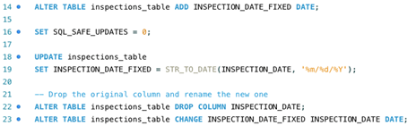
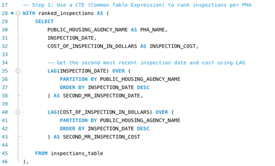
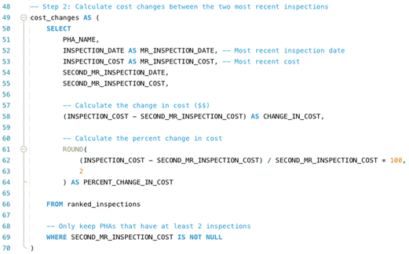
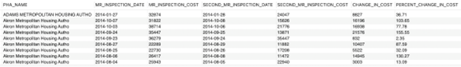
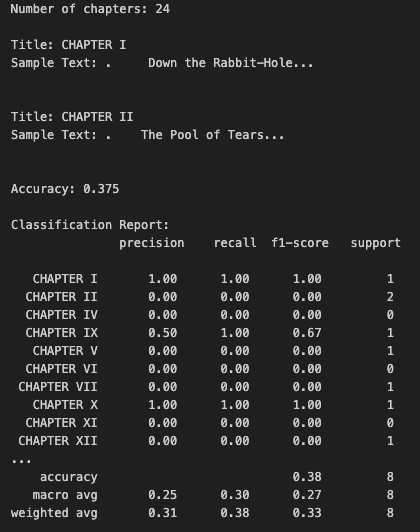
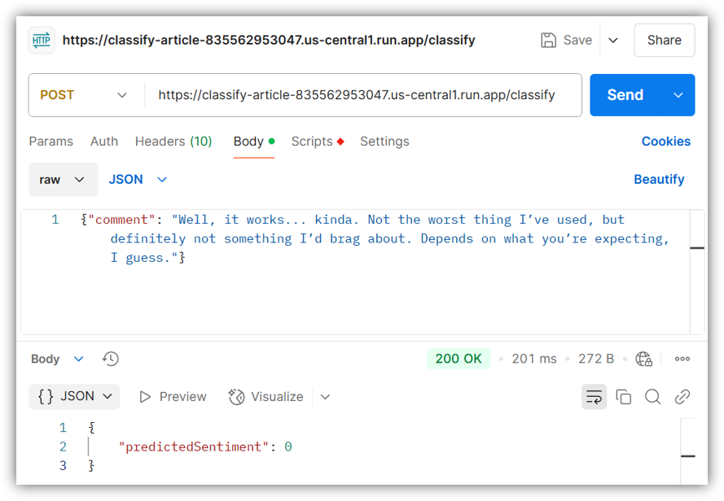
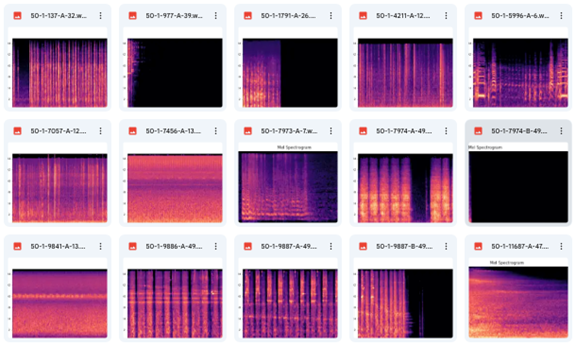
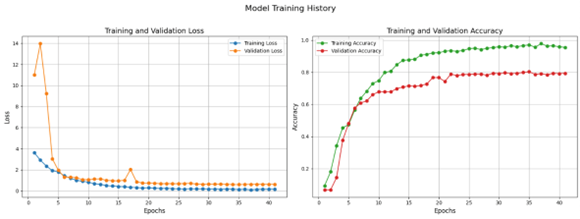
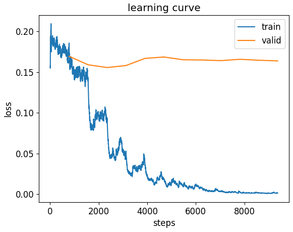
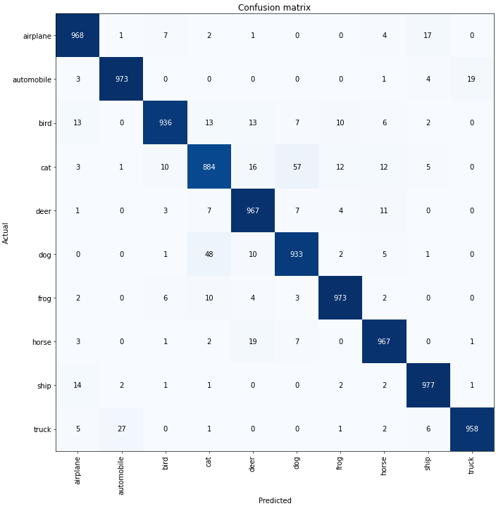

# 🌟 James Li — Data Analytics & AI Portfolio

Welcome to my project portfolio!  

⚡ Click to view Qualifications Summary

### 📊 Data Analytics & Statistical Modeling
- Proficient in **R and Python** for data cleaning, wrangling, visualization, and exploratory analysis.
- Built forecasting and statistical models including **ARIMA**, linear regression, and hypothesis testing.
- Conducted NLP workflows with **NLTK**, including tokenization, POS tagging, TF–IDF vectorization, and multi-class text classification.
- Performed advanced EDA on large datasets from retail, transportation, housing, and healthcare domains.

---

### 🤖 Machine Learning & AI Development
- Experienced with **scikit-learn, TensorFlow, and Hugging Face** for supervised and deep learning models.
- Developed models including **SVM, Random Forest, Gradient Boosting, Logistic Regression, LSTM**, and **DistilBERT**.
- Deployed ML microservices using **Docker + Google Cloud Run** for real-time inference.
- Built clustering models using **K-means and Hierarchical Clustering** to identify behavioral and demand patterns.

---

### 🧵 Big Data & Distributed Computing
- Worked with **Apache Spark** (PySpark & sparklyr) for large-scale ETL, transformation, and aggregation.
- Analyzed multi-year housing market datasets (ZHVI & HPI) using distributed processing.
- Created time-series visualizations and large-volume statistical summaries from Spark-based pipelines.

---

### 🗄️ SQL, Database Design & Data Warehousing
- Designed relational schemas and normalized real-world datasets to **1NF, 2NF, and 3NF**.
- Built complete **Star Schemas** for ICU/SICU capacity, pharmacy claims, and public housing inspection data.
- Implemented **PK/FK constraints, surrogate keys, SCD Type 2**, and aggregated fact tables.
- Strong SQL experience: joins, inserts, updates, deletes, aggregations, window functions (LAG/LEAD).

---

### 📈 Business Intelligence & Visualization
- Created analytical dashboards using **Tableau** and data visualizations in **ggplot2, Seaborn, Matplotlib**.
- Built correlation heatmaps, treemaps, time-series charts, seasonal patterns, bar/line plots, and EDA summaries.
- Produced executive-level insights for operational decisions in healthcare, retail, real estate, and transportation.

---

### ☁️ Software Development & Cloud Deployment
- Containerized ML models using **Docker** and deployed them as scalable services on **Google Cloud Run**.
- Familiar with API integration and testing using Postman and RESTful designs.
- Skilled in collaborative development using Git, GitHub, and Markdown documentation.

---

### 🛠️ Technical Skills
**Languages:** Python, R, SQL  
**ML Frameworks:** scikit-learn, TensorFlow, Hugging Face Transformers, NLTK  
**Big Data:** PySpark, sparklyr  
**Databases:** MySQL, Star Schema, SCD Type 2  
**Visualization:** Tableau, ggplot2, Seaborn, Matplotlib  
**Cloud/DevOps:** Docker, Google Cloud Run  
**Tools:** Jupyter Notebook, RStudio, GitHub, Postman

---

***Click each section below to explore projects by language or domain.***

---

## 🧮 EDA Projects (R + Python)

📘 Click to view EDA projects

---

### [R-Project 1: Superstore Sales, Profit & Forecasting Analysis (R)](https://github.com/FANXYBIN/Project1_Superstore_Dataset)

📘 Click to view R-based projects

This project analyzes the **Superstore dataset (2011–2014)** to uncover insights about sales, profit, product performance, customer segments, and regional trends using **R**.  
It includes extensive **data cleaning**, **EDA visualizations**, **correlation analysis**, **boxplots**, and **ARIMA forecasting** for predicting 2015 sales and profit.

* **Dataset:** Superstore Dataset (Kaggle, 2011–2014)  
* **Tools:** R, tidyverse, ggplot2, corrplot, treemap, forecast  
* **Techniques:** Data wrangling, bar charts, scatterplots, density plots, tree maps, correlation matrices, boxplots, time-series forecasting  
* **Goal:** Understand the superstore’s historical performance and forecast next-year trends.

---

### 📁 Dataset Overview

The dataset contains 24+ columns including:

- **Sales, Profit, Discount, Quantity, Shipping Cost**  
- **Category, Sub-Category, Shipping Mode**  
- **Market, Region, Segment**  
- **Order & Ship Dates**

  
  
<em>Datatypes descriptions of the dataset.</em>

---

### 🧹 Data Cleaning & Preparation

#### ✔ Checked data types and structure  
#### ✔ Identified missing values  
Only “Postal Code” contains NA values — removed for analysis.

#### ✔ Created a clean dataset `new_superstore`  
Contains only rows/columns with **no missing values**.

  
  
<em>NA inspection and clean dataset creation.</em>

---

### 📊 Orders & Customer Behavior

#### Total Orders by Market, Region, Ship Mode & Segment

  
  
<em>Total Orders by Market, Region, Ship Mode & Segment</em>

- **APAC** and **Central** region show the highest order volumes.

---

### 💰 Sales & Profit by Market & Region

  

- **APAC** market and **Central** region perform best  
- **Canada** shows significantly lower sales & profit.

---

### 📦 Product Category & Subcategory Analysis

#### Orders by Category / Subcategory

  

Top subcategories with highest order count:

- **Binders** (12%)  
- **Storage**  
- Lowest: **Tables** (~2%)

#### Pie Chart of Subcategory Orders

  

---

### 🧭 Sales & Profit by Category / Subcategory

  

**Top findings:**

- **Phones** → highest sales  
- **Copiers** → highest profit  
- **Tables** → incurred losses  

---

### 🌳 Treemap Visualization

  
  
<em>Sales treemap by Category → Sub-Category</em>

---

### 🔍 Scatterplots

  

Observations:

- Sales vs Shipping Cost → **positive relationship**  
- Sales vs Profit → **weak linear relationship**  
- Discount heavily reduces profit  

---

### 📈 Density Plots

  

- Sales & Discount → right-skewed  
- Profit → slightly left-skewed  
- Quantity → peak around 1–2 units  

---

### 🔗 Correlation Analysis

  

Key relationships:

- Sales ↔ Shipping Cost → **strong positive correlation**  
- Profit ↔ Discount → **negative correlation**  

---

### 📦 Boxplots

  

  

- Many outliers in Sales / Quantity / Discount  
- Quantity ranges from **1 → 14**  

---

### 📅 Monthly & Annual Trends

#### Annual Sales / Profit (2011–2014)

  

Both Sales & Profit show **yearly upward trends**.

---

#### 📆 Monthly Sales / Profit

  

  

---

### 🔮 ARIMA Forecasting (2015)

Using monthly aggregated data:

- Fitted **Auto ARIMA** for Sales & Profit  
- Forecasted next 12 months  
- Confidence interval shown in grey

  

  

**Forecast Insight:**  
➡ 2015 sales and profit will continue rising, with seasonality similar to previous years.

---

### 🧠 Key Insights

- **APAC + Central** regions drive the most revenue  
- **Phones** (Technology) generate the highest sales  
- **Copiers** generate the highest profit  
- **Tables** consistently lose money  
- Discount negatively impacts profit  
- Yearly performance improves steadily  
- ARIMA forecast predicts **continued growth** in 2015  

---

### 🧠 Skills Demonstrated

- R data cleaning & wrangling  
- Visual analytics (bar charts, scatterplots, boxplots, density plots)  
- Correlation analysis & treemaps  
- Time series modeling with ARIMA  
- Interpreting patterns & forecasting future performance  

### [R-Project 2: Beijing Housing Price Analysis & Hypothesis Testing(R)](https://github.com/FANXYBIN/R-Project-2_Beijing_Housing_Price_Dataset)

📊 Click to view project details

This project analyzes **housing prices in Beijing** using R.  
The workflow includes extensive **data cleaning**, **EDA visualizations**, **correlation analysis**, and **hypothesis testing** to understand the key factors influencing house prices.

* **Dataset:** Beijing Housing Price (Kaggle – 318,851 observations, 26 variables)  
* **Tools:** R, tidyverse, ggplot2, corrplot, dplyr  
* **Techniques:** Data cleaning, variable recoding, histograms, correlation analysis, boxplots, scatterplots, t-tests  
* **Goal:** Explore the structure of Beijing’s housing market and validate insights using statistical hypothesis testing.

---

### 📁 Dataset Overview

The dataset contains housing transaction records from Beijing, including:

- Pricing (totalPrice, price per m²)  
- House characteristics (square, rooms, floor, buildingType, structure)  
- Location information (Lng/Lat, district, communityAverage)  
- Accessibility indicators (elevator, subway)

  
  
<em>Dataset structure overview.</em>

---

### 🧹 Data Cleaning & Preparation

From the raw dataset (318,851 rows), the following steps were taken:

#### ✔ Selected Relevant Variables  
(id, tradeTime, totalPrice, price, square, rooms, floor, communityAverage, elevator, subway, buildingType, buildingStructure)

#### ✔ Converted Categorical Variables to Factors  
Based on dataset documentation:

- **buildingType** → Tower, Bungalow, Plate/Tower, Plate  
- **buildingStructure** → Mixed, Brick/Wood, Steel, Concrete, etc.  
- **elevator** → 0/1  
- **subway** → 0/1  

  
  
<em>Original column types.</em>

  
  
<em>Cleaned factor levels.</em>

#### ✔ Removed Missing Values  
2,580 rows containing NA were removed.

  
  
<em>NA count before filtering.</em>

#### ✔ Selected Numerical Features for Correlation  
(totalPrice, price, square, rooms, bathRoom, drawingRoom, communityAverage, floor)

  
  
<em>Numerical dataset for correlation analysis.</em>

---

### 📊 Exploratory Data Analysis (EDA)

#### 📈 Histograms: Price & Total Price  
Both price per m² and total price show **right-skewed distributions**, with most prices concentrated between 20,000–60,000.

  
  
<em>Histogram of price per m².</em>

  
  
<em>Histogram of total price.</em>

---

### 🔗 Correlation Analysis

Strong positive correlations were found among:

- **totalPrice** ↔ price, square, communityAverage  
- **square** ↔ rooms, bathRoom, drawingRoom  

  
  
<em>Correlation matrix.</em>

  
  
<em>Corrplot visualization.</em>

---

### 📦 Boxplots: Price by Categorical Variables

#### Building Type  
🏆 Bungalows are the most expensive building type.

  
  
<em>Price vs. Building Type.</em>

#### Building Structure  
Steel/Concrete buildings tend to be more expensive.

  
  
<em>Price vs. Building Structure.</em>

#### Elevator  
Homes with elevators → significantly higher prices.

  
  
<em>Price vs. Elevator.</em>

#### Subway  
Homes near subway stations → higher average prices.

  
  
<em>Price vs. Subway Access.</em>

---

### 🔍 Scatterplots

#### Price vs Total Price (by building type & structure)

  
  
<em>Price vs total price by building type.</em>

  
  
<em>Price vs total price by building structure.</em>

#### Group-based Regression Slopes

  
  
<em>Square vs Price — grouped by building type.</em>

  
  
<em>Square vs Price — grouped by building structure.</em>

---

### 📅 Average Housing Price by Month

Shows seasonal patterns & monthly variation in housing prices.

  
  
<em>Monthly average housing prices.</em>

---

### 🧪 Hypothesis Testing

#### **Question 1:**  
Is the sample mean of housing prices equal to 43,549.6?

Result: **Fail to reject H₀**  
➡ Price is statistically similar to the given value.

  

---

#### **Question 2:**  
Is there a difference in price between **Bungalows** vs **Towers**?

Result: **Reject H₀**  
➡ Bungalows significantly more expensive.

  

---

#### **Question 3:**  
Are 2016 prices greater than 2017 prices?

Result: **Reject H₁**  
➡ 2017 prices are significantly higher.

  

---

### 🧠 Key Insights

- Housing prices in Beijing are strongly influenced by **square meters**, **community average price**, and **building structure**.  
- Homes near subways or with elevators have higher valuations.  
- Bungalows are the most expensive housing type.  
- Prices increased **significantly** from 2016 → 2017.  
- All hypotheses were validated through t-tests (one-sample and two-sample).

---

### 🧠 Skills Demonstrated
- Data wrangling and cleaning in R  
- Visualization with ggplot2 and corrplot  
- Statistical hypothesis testing (one-sample, two-sample t-tests)  
- Interpretation of descriptive and inferential statistics  
- Exploratory data analysis workflows  

### [R-Project 3: Diamond Price Analysis, Regression Modeling & ANOVA (R)](https://github.com/FANXYBIN/R-Project-3-Diamond-Price-Analysis-Regression-Modeling-ANOVA-R-)

📊 Click to view project details

This project analyzes a **diamond price dataset (53,940 rows, 10 features)** from Kaggle to understand **price determinants**, evaluate how **carat and dimensions** influence price, and test whether **cut, color, and clarity** significantly affect mean price.  
The analysis uses **correlation**, **linear regression**, and **ANOVA** to uncover meaningful trends in diamond valuation.

* **Dataset:** Kaggle Diamond Prices (53,940 rows × 10 variables)  
* **Tools:** R, tidyverse, ggplot2, corrplot, caret, psych  
* **Techniques:** EDA, histograms, barplots, boxplots, correlation analysis, linear regression, ANOVA, Tukey post-hoc tests  
* **Goal:** Identify the strongest predictors of diamond price and evaluate statistical significance across categorical groups.

---

### 📁 Dataset Overview

The dataset contains:

- **price** — USD price  
- **carat** — weight  
- **cut** — Fair → Ideal  
- **color** — D → J  
- **clarity** — I1 → IF  
- **depth, table** — proportions  
- **x, y, z** — measurements in mm

  
  
<em>Dataset structure overview.</em>

---

### 🧹 Data Cleaning

The dataset contains **no missing values** (verified in R).  
All variables were typed correctly (numeric vs categorical), so no transformation was required.

---

### 🔗 Correlation Analysis

We selected 7 numerical features:

- price, carat, depth, table, x, y, z

Results from the correlation matrix :contentReference[oaicite:1]{index=1}:

- **carat ↔ price** → **0.92**, strongest relationship  
- **x, y, z ↔ price** → strong positive (0.86–0.88)  
- **table ↔ price** → weak positive (0.18)  
- **depth ↔ price** → near zero correlation (–0.01)

  

  

---

### 📈 Histograms

#### Price (right-skewed)

  

#### Carat (right-skewed)

  

#### Depth (approximately normal)

  

#### Table (majority between 55–60)

  

---

### 📦 Bar Plots (Categorical Distributions)

#### Cut  
Most diamonds are **Ideal**, followed by Premium and Very Good.

  

#### Color  
Most common colors: **G, E, F, H**

  

#### Clarity  
Top categories: **SI1 → VS2 → SI2**

  

---

### 📦 Boxplots (Price vs Categories)

#### Price vs Cut

  

#### Price vs Color

  

#### Price vs Clarity

  

---

### 📉 Scatterplots (Price vs Physical Dimensions)

Six scatterplots were produced:  
- Price vs x (length)  
- Price vs y (width)  
- Price vs z (depth)  
- Price vs depth %  
- Price vs table  
- **Price vs carat** (strongest relationship)

  
  
<em>Scatterplots showing relationships between price and physical dimensions.</em>

---

### ❓ Questions & Methods

#### 1️⃣ Which factors have the most impact on diamond prices?
Correlation analysis showed:  
- **Carat** → strongest predictor  
- **x, y, z dimensions** → strong predictors  
- **Table** → weak effect  
- **Depth** → negligible effect

#### 2️⃣ Can price be predicted using carat weight?
Three linear regression models were tested:

| Model | Predictors | Adjusted R² | Notes |
|-------|------------|--------------|-------|
| Model 1 | carat + table + depth | **0.8547** | Best model |
| Model 2 | carat + table | 0.852 | Strong |
| Model 3 | carat + depth | 0.8517 | Strong |

  

  

  

Cross-validation RMSEs were nearly identical → **no overfitting**.

  

#### 3️⃣ Do cut, color, or clarity significantly impact prices?
One-way ANOVA was applied:

  
  
<em>Summary of ANOVA (price ~ cut)</em>

  
  
<em>Summary of ANOVA (price ~ color)</em>

  
  
<em>Summary of ANOVA (price ~ clarity)</em>

- **cut → price** → significant (p < 2e-16)  
- **color → price** → significant (p < 2e-16)  
- **clarity → price** → significant (p < 2e-16)

Tukey post-hoc analysis identified which groups differ:

  
  
<em>Tukey test for Cut</em>

- **Statistically Significant**: Premium - Ideal,  Ideal - Fair, Very Good - Premium, etc.
- **Not Statistically Significant**: Very Good - Good, Premium – Fair

  
  
<em>Tukey test for Color</em>

- **Statistically Significant**: J - E, J - D, I - E, etc.
- **Not Statistically Significant**: E - D, J - I

  
  
<em>Tukey test for Clarity</em>

- **Statistically Significant**: VVS1 - SI2, SI2 - IF, VVS2 - SI2, etc.
- **Not Statistically Significant**: VS2 - I1, SI1 - I1, VS1 - I1, etc.

---

### 🧠 Key Insights

- **Carat weight** is the strongest driver of price  
- Dimensions (x, y, z) also strongly impact price  
- Depth % and table % have little predictive value  
- High-quality diamonds (Ideal cut, D/E colors, VVS/IF clarity) are significantly more expensive  
- Regression models with carat + table + depth predict price **very accurately**  
- ANOVA confirms price differs significantly across cut, color, and clarity groups  

---

### 🧠 Skills Demonstrated

- R-based data cleaning & feature exploration  
- ggplot2 visual analytics (histograms, barplots, boxplots)  
- Correlation & scatterplot analysis  
- Linear regression modeling with K-fold CV  
- ANOVA & Tukey post-hoc comparisons  
- Interpretation of statistical results for real pricing insights  

### [R-Project 4: Big Data Housing Market Analysis with Spark (R + sparklyr)](https://github.com/FANXYBIN/R-Project-4-Big-Data-Housing-Market-Analysis-with-Spark-R-sparklyr-)

🗂️ Click to view project details

This project uses **Apache Spark (sparklyr)** to analyze two large U.S. housing datasets:  
**Zillow Home Value Index (ZHVI)** and the **Annual House Price Index (HPI)**.  
The analysis explores **state-level home values**, **top/bottom ZIP codes**, and **multi-decade price trends** using Spark for distributed data handling.

* **Datasets:**  
  - Zillow Home Value Index (ZHVI)  
  - FHFA Annual House Price Index (ZIP5)  
* **Tools:** R, sparklyr, dplyr, ggplot2, FHFA/Zillow datasets  
* **Techniques:** Spark SQL, distributed filtering/aggregation, histograms, bar charts, time-series plotting  
* **Goal:** Understand geographic differences in home values and long-term real estate trends using big data tools.

---

## 📁 Dataset Overview

Two datasets were analyzed:

### ✔ **1. ZHVI — Zillow Home Value Index**  
Contains typical home values across all U.S. ZIP codes.

### ✔ **2. Annual House Price Index (HPI)**  
Historical housing appreciation for each ZIP code since the 1990s, normalized to 1990 and 2000 bases.

Spark was used to load, process, filter, and aggregate millions of records.

---

## 🧹 Data Processing with Spark

Using **sparklyr**, the workflow included:

✔ Connecting to a local Spark session  
✔ Loading ZHVI & HPI CSV files into Spark clusters  
✔ Removing unnecessary columns  
✔ Spark SQL for filtering, grouping, aggregating  
✔ Converting results to R for visualization  

---

# 📊 Part 1 — ZHVI Housing Value Analysis

## 📈 1. Distribution of Home Values (Figure 1)

The ZHVI distribution is **strongly right-skewed**, with most homes priced below **$250k**  
and a long tail extending to above **$1M**.

  
  
<em>Figure 1. ZHVI distribution (0–1,000,000 range).</em>

✔ Most properties fall between **$200k–$250k**  
✔ Very expensive properties (> $750k) are rare  
✔ High-value ZIP codes heavily shift the upper tail  

---

## 📊 2. Average Home Values by State (Figure 2)

  
  
<em>Figure 2. Average ZHVI by U.S. state.</em>

### Key Findings  
- **Highest states:**  
  🥇 District of Columbia (DC)  
  🥈 Hawaii (HI)  
  🥉 California (CA)  

- **Lowest states:** Mississippi (MS), Alabama (AL), West Virginia (WV)

➡ High-demand coastal states show dramatically higher home values.

---

## 🏆 3. Top 10 & Bottom 10 ZIP Codes (Figures 3 & 4)

### Top 10 ZIP Codes by Home Value  

  
  
<em>Figure 3. Top 10 regions by home value.</em>

- ZIP **94027** (~$6.6M) is the highest in the entire dataset  
- Indicates extremely high-end real estate markets (Silicon Valley, luxury areas)  

### Bottom 10 ZIP Codes by Home Value  

  
  
<em>Figure 4. Bottom 10 regions by home value.</em>

- Lowest ZIP code: **72123** (~$11k)  
- Rural or economically distressed areas dominate the bottom tier  

➡ Demonstrates **extreme inequality** in U.S. housing markets.

---

# 📈 Part 2 — HPI Time Series Analysis (ZIP Code 1040)

Spark was used to filter and extract HPI rows for ZIP code **1040**.  
Three time series were plotted:

- **Raw HPI**  
- **HPI normalized to 1990**  
- **HPI normalized to 2000**

  
  
<em>Figure 5. Five-digit ZIP code 1040 — HPI trend over time.</em>

### Key Observations  
✔ Home prices grew strongly from 1990 → 2007  
✔ Prices dropped significantly during the **2008 financial crisis**  
✔ Sharp rebound after 2012  
✔ Continued growth toward 2020  

Normalizing to 1990/2000 makes the long-term appreciation clearer.

---

# 🧠 Insights & Interpretation

### 🏡 **ZHVI Dataset Insights**
- Most U.S. ZIP codes have home values below **$500k**  
- High-value homes are concentrated in a few regions  
- DC, HI, and CA dominate housing value rankings  
- Rural states show much more affordable housing  

### 📬 **Top/Bottom ZIP Codes**
- ZIP **94027** stands out as an extreme luxury outlier  
- Bottom ZIP codes suggest low-demand, low-income regions  

### 📈 **HPI Time-Series Insights**
- U.S. home prices show **long-term upward trends**  
- 2008 crash clearly visible, but recovery was strong  
- Useful for investors, policymakers, and economic modeling  

---

# 🧠 Skills Demonstrated

- Spark connection & distributed data processing  
- Data transformation using dplyr + sparklyr  
- Big data EDA workflows  
- ggplot2 visualization of Spark-managed data  
- Time series interpretation (HPI trends)  
- Analysis of geographic housing market inequality  

### [P-Project 1: Seoul Bike Sharing Analysis — Clustering, EDA & Machine Learning(Python)](https://github.com/FANXYBIN/P-Project1-Seoul-Bike-Sharing-Dataset)

🗂️ Click to view project details

This project performs a full **data analytics and machine learning workflow** on the **Seoul Bike Sharing dataset**.  
It includes **EDA**, **K-means & hierarchical clustering**, and multiple **predictive models**  
(SVM, Random Forest, Gradient Boosting, Linear Regression) to understand and forecast rental behavior.

* **Dataset:** Seoul Bike Sharing (8,760 rows × 14 features)  
* **Tools:** Python, pandas, NumPy, seaborn, matplotlib, scikit-learn, scipy, statsmodels  
* **Techniques:** EDA, histograms, scatterplots, heatmaps, clustering (K-means & Ward), classification models, regression  
* **Goal:** Identify rental patterns, uncover cluster structures, and build prediction models.

---

## 📁 Dataset Overview

The dataset includes:

- **Rented Bike Count**  
- **Date**, **Hour**  
- **Temperature**, **Humidity**, **Wind Speed**, **Visibility**  
- **Dew Point Temperature**, **Solar Radiation**, **Rainfall**, **Snowfall**  
- **Holiday**, **Functioning Day**, **Season**

  
  
<em>Dataset structure and features.</em>

---

## 🧹 Data Cleaning & Feature Preparation

- No missing values  
- Extracted **Month** and **Weekday** features  
- One-hot encoded: Holiday, Functioning Day, Season  
- Selected weather variables for clustering:
  - Temperature, Wind Speed, Visibility  
  - Dew Point Temperature  
  - Solar Radiation  
  - Rainfall, Snowfall  

  
  
<em>No missing values in the dataset.</em>

---

# 📊 **Part 1 — Exploratory Data Analysis (EDA)**

## 📈 Histograms  
Temperature, wind speed, visibility, and rental counts.

  

  

  

### Key Patterns  
- Rentals highly skewed (many low-rent hours)  
- Temperature peaks around 20°C  
- Visibility peaks at 2,000m  
- Wind speed mostly 0–2 m/s  

---

## 🔍 Scatterplots

  

  

  

### Insights  
- Temp ↑ → Rentals ↑  
- Wind ↑ → Rentals ↓  
- Visibility ↑ → Rentals ↑  
- Rental peaks: **17:00–20:00**

---

## 🕒 Seasonal Rental Trends

  

- **Summer** → highest demand  
- **Winter** → lowest  

---

## 🔥 Correlation Heatmap

  

Strongest correlations with rental demand:

- **Temperature** → +0.54  
- **Hour** → +0.41  
- **Humidity** → –0.20  

---

# 🔍 **Part 2 — Clustering Analysis**

## 🔢 K-means Clustering

- Features normalized  
- Tested **k = 1 to 10**  
- Elbow method used to select k

  
  
<em>Elbow Plot — Optimal Clusters ≈ 4.</em>

### ✔ Interpretation  
- WCSS drops steeply until **k = 4**  
- After k = 4 → diminishing returns  
➡ **Optimal Number of Clusters = 4**

---

## 🌳 Hierarchical Clustering (Ward)

  
  
<em>Dendrogram showing clear 4-cluster structure.</em>

### ✔ Interpretation  
- Large vertical merge distances identify stable groups  
- Cutting at height ≈ 30,000 yields **4 clusters**  
- Confirms K-means result

---

## 🧠 Clustering Insights

Cluster tendencies across weather conditions:

| Cluster | Characteristics | Rental Impact |
|--------|-----------------|----------------|
| **C1** | High temp, clear skies, good visibility | 🔼 High rentals |
| **C2** | Cold temp, low solar radiation | 🔽 Low rentals |
| **C3** | Rainfall / Snowfall | 🔽 Very low rentals |
| **C4** | Warm, slightly cloudy, moderate wind | Moderate rentals |

These clusters can support **inventory planning**, **weather-based promotions**, and **real-time bike redistribution strategies**.

---

# 🤖 **Part 3 — Machine Learning Models**

## 🔧 Data Processing

- Rented Bike Count converted into **categories** (Low / Medium / High) for classification  
- Train/Test split: **70% / 30%**

---

# 🖥️ **Model 1 — Support Vector Machine (SVM)**

- **Accuracy:** 0.7899  
- **Precision:** 0.7767  
- **Recall:** 0.7899  
- **F1:** 0.7793  

  

  

  

---

# 🌲 **Model 2 — Random Forest**

- **Accuracy:** 0.8002  
- **Precision:** 0.7921  
- **Recall:** 0.8002  
- **F1:** 0.7950  

  

🏆 **Best Model Overall**

---

# ⚡ **Model 3 — Gradient Boosting**

- **Accuracy:** 0.7983  
- **Precision:** 0.7894  
- **Recall:** 0.7983  
- **F1:** 0.7920  

  

---

# 📉 **Part 4 — Multiple Linear Regression (OLS)**

  

  

### Key Coefficients

- **Hour:** +28.6  
- **Temperature:** +25.5  
- **Humidity:** –8.87  
- **Rainfall:** –67.3  

### Model Strength  
- **R² = 0.473**  
- **F-statistic = 609.8** (p < 0.001)  
➡ Moderately strong linear model

---

# 🧠 Final Insights

### 📌 Clustering Insights
- Weather and environmental factors naturally form **4 meaningful clusters**  
- Useful for **inventory planning**, **weather prediction strategy**

### 📌 EDA Insights
- Rentals peak around **5 PM–8 PM**  
- Best temperature range: **20°C–30°C**  
- Visibility improves demand; wind reduces demand

### 📌 ML Insights
- **Random Forest** performs best for rental classification  
- Weather + time features predict demand effectively  
- Regression model quantifies rental impact of each feature

---

# 🧠 Skills Demonstrated

- Python EDA (seaborn, matplotlib)  
- K-means & Hierarchical Clustering (scikit-learn, SciPy)  
- Machine Learning Classification  
- Linear Regression with statsmodels  
- Data preprocessing and feature engineering  
- Interpretation of temporal + weather patterns  

---

## 💾 SQL Projects

🗄️ Click to view SQL-based data management and analytics projects

---

### [S-Project 1: Hotel Management Database Design, Normalization & SQL Operations (MySQL)](https://github.com/FANXYBIN/S-Project-1-Hotel-Management-Database-Design-Normalization-SQL-Operations-MySQL-)

🗂️ Click to view project details

This project consists of the full lifecycle of designing and implementing a **Hotel Management System database**.  
Across three stages, we built an ERD, created tables, populated data, normalized the schema to 3NF,  
and practiced core SQL operations (DDL, DML, DQL).

**This project merges three assignments:**
1. **Database Creation (ERD → MySQL Workbench)**  
2. **Normalization to 3NF (No anomalies, dependency checks)**  
3. **SQL Command Practice (INSERT, UPDATE, ALTER, DELETE, AGGREGATES)**  

* **Tools:** MySQL Workbench, SQL, ERD/EERD modeling  
* **Techniques:** ERD design, table creation, primary/foreign keys, 1NF–3NF normalization, SQL CRUD, aggregate queries  
* **Goal:** Build a fully functional, clean, normalized relational database for hotel operations.

---

# 🧱 **1. Database Design**  

We designed an end-to-end relational schema for a hotel system.  
Entities include:

- **Guest**  
- **Hotel**  
- **Room Type**  
- **Room**  
- **Staff**  
- **Position**  
- **Bill**  
- **Reservation** (central linking table)

### ✔ ERD (Conceptual Model)

  
  
<em>Original ERD showing 8 entities and their relationships.</em>

### ✔ EERD (MySQL Workbench – Logical Model)

  
  
<em>MySQL Workbench auto-generated EERD with PK/FK constraints.</em>

### Key Design Features
- Primary keys defined for all tables  
- Foreign keys connecting Guest ↔ Reservation ↔ Room ↔ Staff ↔ Bill  
- All attributes assigned appropriate data types (INT, VARCHAR, DECIMAL, DATE)  
- Clean 1-to-many and many-to-one relationships  

This schema allows a hotel to track guests, reservations, rooms, staff roles, and billing.

---

# 🧹 **2. Normalization to 3NF**  

We validated that the entire schema is already in:

### ✔ **1NF**
- No repeating groups  
- Atomic values  
- Primary keys clearly defined  

### ✔ **2NF**
- All non-key attributes depend fully on the PK  
- No partial dependencies  

### ✔ **3NF**
- No transitive dependencies  
- All attributes depend **only** on their table’s primary key  

### Example: **Guest Entity**

  
  
<em>Guest entity attributes demonstrate full functional dependency.</em>

### Example: **Reservation Entity**  
The most important central table linking five foreign keys.

  
  
<em>Reservation table cleanly meets 1NF–3NF rules.</em>

---

# 🧪 **3. SQL Operations**  

We practiced essential SQL commands including:

- `INSERT INTO`  
- `UPDATE`  
- `ALTER TABLE`  
- `DELETE`  
- `SELECT + AGGREGATES (MAX, MIN, SUM, COUNT, AVG)`  

Each exercise was done with sample data inserted into the **Room, Room_Type, and Hotel** tables.

---

### 📝 **INSERT INTO** — Adding new rows  
Example: Populating Room, Room_Type, and Hotel tables.

  
  
<em>Inserting rows into multiple tables using INSERT INTO.</em>

---

### 🛠 **ALTER TABLE** — Adding a new column  
Example: Adding a **Hotel_numstaff** column to the Hotel table.

  
  
<em>ALTER TABLE used to add a new attribute.</em>

---

### ✏️ **UPDATE** — Modifying values  
Example: Updating the newly added column with staff counts.

  
  
<em>UPDATE command applied with WHERE conditions.</em>

---

### 📊 **Aggregate Functions** — MAX, MIN, SUM, COUNT, AVG  
Used on **Room_price**, **Hotel_numrooms**, and **Hotel_numstaff**.

  
  
<em>Summary statistics using aggregate functions.</em>

---

### 🗑 **DELETE** — Removing rows  
Example: Removing sample rows from Room.

  
  
<em>DELETE operation applied to remove certain Room entries.</em>

---

# 🧠 Key Takeaways

### ✔ Database Creation  
- Built complete relational schema using MySQL Workbench  
- Defined proper PK/FK relationships  
- Populated sample data visually  

### ✔ Normalization  
- Verified schema met 1NF, 2NF, 3NF  
- Demonstrated clean functional dependencies  
- Ensured no redundancy or anomalies  

### ✔ SQL Practice  
- Used INSERT, UPDATE, ALTER, DELETE  
- Performed summary statistics  
- Strengthened SQL proficiency using real tables  

---

# 🧠 Skills Demonstrated

- ERD & EERD design  
- Relational database construction  
- Third Normal Form (3NF) normalization  
- SQL DDL, DML, DQL commands  
- Referential integrity (PK/FK design)  
- MySQL Workbench modeling + execution  

### [S-Project 2: TechCrunch Dataset Normalization & Recipe Database SQL Operations (MySQL)](https://github.com/FANXYBIN/S-Project-2-TechCrunch-Dataset-Normalization-Recipe-Database-SQL-Operations-MySQL-)

🗂️ Click to view project details

This project includes two major components:

1. **Full normalization of the TechCrunch startup funding dataset** (1NF → 3NF)  
2. **Practical SQL operations** on a recipe database, including INSERT, SELECT (multi-table join), and relationship management.

It demonstrates data modeling, functional dependency analysis, ERD creation, and SQL proficiency.

* **Dataset 1:** TechCrunch Startup Funding (CSV)  
* **Dataset 2:** Recipe Database (recipe_main, category, ingredients, rec_ingredients)  
* **Tools:** MySQL, SQL, ERD modelling  
* **Techniques:** 1NF/2NF/3NF validation, dependency resolution, SQL INSERT/SELECT queries  
* **Goal:** Convert an unnormalized dataset into a clean relational schema and demonstrate SQL proficiency through real operations.

---

# 🧩 Part 1 — TechCrunch Dataset Normalization (1NF → 3NF)

The TechCrunch dataset contains funding event records (company, date, category, state, etc.).  
Goal: Identify primary keys, verify normal forms, and produce a fully normalized schema.

---

## 🔑 **Choosing the Primary Key**

A good primary key:  
- **fund_id** → unique for each funding event  
Invalid primary keys:  
- `company` → appears multiple times  
- Composite (`company`, `fundedDate`) → duplicates possible

---

## ✔ 1NF — First Normal Form

- All fields contain **atomic values**  
- No multi-valued fields  
- `fund_id` ensures row uniqueness  

➡ **Dataset satisfies 1NF**

---

## ✔ 2NF — Second Normal Form

- Primary key is a **single attribute** → `fund_id`  
- No partial dependencies possible  

➡ **Dataset satisfies 2NF**

---

## ❌ 3NF Violation — Before Normalization

There are **transitive dependencies**, e.g.:

- `state` depends on `city`  
- `category` is not decomposed into its own entity  

➡ Dataset **not in 3NF**.

---

# 🧱 **Normalized 3NF Schema**

The dataset is decomposed into **four entities**:

### **📌 Company Table**
| Column | Type | Notes |
|--------|-------|---------|
| company_id | PK | Unique ID |
| company | text | Company name |
| numEmps | int | Employees |
| category_id | FK | → Category |
| city_id | FK | → City |

### **📌 Funding Table**
| Column | Type | Notes |
|--------|-------|---------|
| fund_id | PK | Funding event |
| company_id | FK | → Company |
| fundedDate | date | Date of round |
| raisedAmt | int | Capital raised |
| raisedCurrency | text | Currency |
| round | text | Seed/Series A/etc.|

### **📌 City Table**
| Column | Type |
|--------|--------|
| city_id | PK |
| city | text |
| state | text |

### **📌 Category Table**
| Column | Type |
|--------|--------|
| category_id | PK |
| category | text |

---

## 🔗 Relationships

- **Company 1:N Funding** — companies may receive many rounds  
- **Company N:1 City** — each company belongs to one city  
- **Company N:1 Category**  

---

## 📌 ERD (Normalized Model)

  
  
<em>Normalized 3NF ERD built from the TechCrunch dataset.</em>

---

# 🍽️ Part 2 — Recipe Database SQL Operations

This section demonstrates practical SQL skills using a structured recipe database:

- Insert new categories  
- Insert new recipes  
- Insert new ingredients  
- Link recipes and ingredients  
- Perform multi-table JOINs  
- Display combined results

---

## 🍝 Adding Recipes & Ingredients

1. **Add “Italian” and “Baking” to “category” table.**  

  

  

2. **Add “Spaghetti” and “Blueberry Muffins” recipes into “recipe_main” table.**  

  

  

3. **Add some ingredients into “ingredients” table.**  

  

  

4. **Add some amounts of ingredients into “rec_ingredients” table.**  

  

  

---

## 🔗 Linking Recipes to Ingredients (Join Table)

Write only one SQL query that returns all information on only the two new recipes that inserted from all the tables created above.

  

  

---

## 📊 Multi-table JOIN Results (Final Output)

Write a SELECT query that identifies the recipe name, category name, and ingredient name, and ingredient amount. No other variables should be included.

  

  
  
<em>Screenshot: Joined results showing recipe, category, ingredients, amount.</em>

---

# 🧠 Key Insights

### ✔ Normalization  
- Identified primary key (`fund_id`)  
- Verified dataset satisfies 1NF and 2NF  
- Resolved all transitive dependencies for 3NF  
- Produced a clean, modular relational schema

### ✔ SQL Practice  
- Inserted rows into multiple related tables  
- Linked recipes to ingredients using a junction table  
- Executed multi-table JOIN queries  
- Interpreted query output using the relational structure  

---

# 🧠 Skills Demonstrated
- Database normalization (1NF → 3NF)  
- ERD modeling & schema decomposition  
- SQL INSERT / JOIN / relationship management  
- Understanding of functional dependencies  
- Translating raw data → relational model  
- Clear documentation using diagrams and SQL output screenshots  

### [S-Project 3: ICU/SICU Star Schema Design & Critical Care Bed Analysis (SQL + Data Warehousing)](https://github.com/FANXYBIN/S-Project-3-ICU-SICU-Star-Schema-Design-Critical-Care-Bed-Analysis-SQL-Data-Warehousing-)

🗂️ Click to view project details

This project designs a **Star Schema** for ACME Health’s ICU/SICU hospital network and performs analytical summarization of **licensed, census, and staffed beds** across all facilities.  
The analysis supports leadership’s goal of identifying hospitals best suited for a **nurse staffing intervention pilot**.

* **Tools:** SQL, MySQL Workbench, Data Warehousing concepts  
* **Techniques:** Dimensional modeling, star schema design, fact/dimension identification, hospital performance analytics  
* **Goal:** Model critical care resources and identify top-performing hospitals with ICU/SICU capacity.

---

# 🧱 1. Dimensional Modeling (Fact & Dimension Identification)

The dataset includes three core tables: **bed_type**, **business**, and **bed_fact**.

### 📌 Dimension Table — `bed_type`

  

This table describes the type of bed (ICU, SICU, etc.).

| Column    | Example Type | Role        | Description                |
|-----------|--------------|------------|----------------------------|
| bed_id    | INT (PK)     | Key         | Unique identifier for bed type |
| bed_code  | VARCHAR      | Dimension   | Short code for bed type (e.g., 4 = ICU, 15 = SICU) |
| bed_desc  | VARCHAR      | Dimension   | Full description of bed type |

---

### 📌 Dimension Table — `business`

This table represents each hospital / business unit and includes some aggregate metrics.

| Column           | Example Type | Role              | Description                                      |
|------------------|--------------|-------------------|--------------------------------------------------|
| ims_org_id       | INT (PK)     | Key               | Unique hospital / organization ID                |
| business_name    | VARCHAR      | Dimension         | Name of the hospital                             |
| bed_cluster_id   | INT          | Dimension         | Grouping/cluster ID for bed management           |
| ttl_license_beds | INT          | Pre-aggregated fact | Total licensed beds at this hospital            |
| ttl_census_beds  | INT          | Pre-aggregated fact | Total census beds at this hospital              |
| ttl_staffed_beds | INT          | Pre-aggregated fact | Total staffed beds at this hospital             |

---

### 📌 Fact Table — `bed_fact`

  

This is the **central fact table** that stores ICU/SICU bed metrics at the hospital–bed type level.

| Column       | Example Type | Role    | Description                                      |
|--------------|--------------|---------|--------------------------------------------------|
| ims_org_id   | INT (FK)     | Key     | References `business.ims_org_id`                 |
| bed_id       | INT (FK)     | Key     | References `bed_type.bed_id`                     |
| license_beds | INT          | Fact    | Number of licensed beds for this bed type        |
| census_beds  | INT          | Fact    | Number of census beds for this bed type          |
| staffed_beds | INT          | Fact    | Number of staffed beds for this bed type         |

Together, these three tables form the basis of a **star schema**, with `bed_fact` at the center and `business` / `bed_type` as dimension tables.

---

# ⭐ 2. Star Schema (MySQL Workbench)

The final schema contains:

### ⭐ **FACT TABLE**
- **bed_fact**  
  - license_beds  
  - census_beds  
  - staffed_beds  

### ⭐ **DIMENSION TABLES**
- **bed_type**  
- **business**

All dimensions join to the fact table via PK → FK relationships.

  

  
  
<em>Star Schema for ICU/SICU resource modeling.</em>

---

# 📊 3. ICU & SICU Capacity Analysis (Leadership View)

Leadership requested:

> “Identify top hospitals with ICU (bed_id = 4) or SICU (bed_id = 15), ranked by total licensed beds.”

### ✔ Licensed Beds — Top Hospitals  

  

  
  
<em>Top 10 hospitals by ICU/SICU licensed beds.</em>

**Top hospitals (licensed beds):**
- Phoenix Children’s Hospital — 247  
- University of Maryland Medical Center — 220  

---

### ✔ Census Beds — Top Hospitals  

  

  
  
<em>Top 10 hospitals by ICU/SICU census beds.</em>

**Top hospitals (census beds):**
- Shands Hospital (University of Florida) — 167  
- Dallas County Hospital Association — 145  

---

### ✔ Staffed Beds — Top Hospitals  

  

  
  
<em>Top 10 hospitals by ICU/SICU staffed beds.</em>

**Top hospitals (staffed beds):**
- Vidant Medical Center — 203  
- Rady Children’s Hospital — 200  

---

# 🔍 4. Drill-Down: Hospitals With BOTH ICU & SICU

Leadership asked for deeper review of facilities containing **both** ICU and SICU bed types.

### ✔ Licensed Beds (ICU + SICU)

  

  

### ✔ Census Beds (ICU + SICU)

  

  

### ✔ Staffed Beds (ICU + SICU)

  

  

---

# 🧠 5. Recommendation to ACME Leadership

Based on consistent top rankings across **licensed, census, and staffed beds**, the two best candidates for the nurse staffing intervention are:

### 🟦 **1. University of Maryland Medical Center**  
- #1 licensed  
- #2 census  
- #1 staffed  
➡ Strongest overall ICU/SICU capacity.

### 🟩 **2. Shands Hospital at the University of Florida**  
- #3 licensed  
- #1 census  
- #2 staffed  
➡ High demand + strong capacity = ideal pilot site.

These hospitals show:

- High patient volumes  
- Large ICU/SICU capacity  
- Consistent performance across multiple metrics  
- Readiness for nurse staffing improvements  

---

# 🧠 Skills Demonstrated
- Dimensional modeling (facts vs. dimensions)  
- Star schema design  
- MySQL Workbench ERD construction  
- Critical-care analytics using bed metrics  
- Executive-level summarization and recommendation  
- Healthcare data interpretation  

### [S-Project 4: Public Housing Inspection Fact Modeling, Aggregation & SCD Type 2 Design (SQL + Data Warehousing)](https://github.com/FANXYBIN/S-Project-4-Public-Housing-Inspection-Fact-Modeling-SCD-Type-2-Design-SQL-Data-Warehousing-)

🗂️ Click to view project details

This project analyzes a public housing inspection dataset and applies **fact/dimension identification**, **aggregated fact table design**, and **Slowly Changing Dimension (SCD) modeling**.  
It also includes business analysis requirements such as detecting cost increases using window functions (e.g., LAG).

* **Dataset:** Public Housing Inspection Data  
* **Tools:** SQL, Data Warehousing, Dimensional Modeling  
* **Techniques:** Fact identification, additive vs. non-additive facts, dimension modeling, aggregated fact tables, SCD Type 2, analytic reporting  
* **Goal:** Build a clean dimensional model and design an executive-level inspection cost analysis report.

---

# 🧱 1. Fact Identification

Based on the dataset, there are **2 measurable facts**:

| Fact Column                       | Description                           | Fact Type      |
|----------------------------------|---------------------------------------|----------------|
| COST_OF_INSPECTION_IN_DOLLARS   | Amount spent on each inspection       | **Additive**   |
| INSPECTION_SCORE                | Result/score of the inspection        | **Non-additive** |

These facts represent the core metrics used by leadership to evaluate housing inspections.  

---

# 🧱 2. Dimension Identification

There are **3 dimensions** in the dataset:

### 📌 **Dimension: Agency**
| Column                         | Description |
|-------------------------------|-------------|
| PUBLIC_HOUSING_AGENCY_NAME    | Housing agency managing the inspection |

### 📌 **Dimension: Development**
| Column                         | Description |
|-------------------------------|-------------|
| INSPECTED_DEVELOPMENT_NAME       | Name of the development |
| INSPECTED_DEVELOPMENT_ADDRESS    | Street address |
| INSPECTED_DEVELOPMENT_CITY       | City |
| INSPECTED_DEVELOPMENT_STATE      | State |

### 📌 **Dimension: Date**
| Column            | Description |
|------------------|-------------|
| INSPECTION_DATE  | When the inspection occurred |

Dimensions provide “who”, “where”, and “when” context for the facts.  

---

# ⭐ 3. Fact Table Design

Two fact tables were designed:  
✔ One **transactional fact table**  
✔ One **aggregated monthly summary fact table**

---

## 📌 **Transactional Fact Table — FactInspection**

| Column                           | Role            | Description |
|----------------------------------|----------------|-------------|
| INSPECTION_ID                    | PK             | Unique inspection ID |
| PUBLIC_HOUSING_AGENCY_NAME       | Dimension      | Agency inspected |
| INSPECTED_DEVELOPMENT_NAME       | Dimension      | Development inspected |
| INSPECTION_DATE                  | Date dimension | When inspection happened |
| COST_OF_INSPECTION_IN_DOLLARS   | Fact           | Cost of inspection |
| INSPECTION_SCORE                | Fact           | Score of inspection |

---

## 📌 **Aggregated Fact Table — FactMonthlyInspectionSummary**

Created because the original dataset does not contain monthly columns.

| Column                    | Description |
|---------------------------|-------------|
| YEAR_MONTH                | Year + month (YYYY-MM) |
| TOTAL_INSPECTION_COST     | Monthly total cost |
| AVG_INSPECTION_SCORE      | Monthly average score |
| NUMBER_OF_INSPECTION      | Monthly inspection count |

This allows leadership to view inspection performance at a higher, aggregated level.  

---

# 🔄 4. Slowly Changing Dimension (SCD) Strategy

The **Agency dimension** can change over time due to:

- Name changes  
- Address changes  
- Mergers or acquisitions  

To preserve historical accuracy, the best method is:

### ✅ **SCD Type 2 — Add a new row**

Why?

- Maintains accurate historical snapshots  
- Keeps original records intact  
- Tracks evolution of agency identity  
- Supports long-term trend analysis  

This ensures that reports always reflect agency details *as they existed at the time of each inspection*.  

---

# 📊 5. Executive Report Requirement — Cost Increase Analysis

Leadership wants:

> “For each Public Housing Agency, check if the **most recent inspection** cost increased compared to the **second-most recent inspection**.”

1.Create inspections_table.

  

2.Change the date format to match MySQL’s YYYY-MM-DD format, as our CSV uses MM/DD/YYYY. In MySQL Workbench Wizard, import INSPECTION_DATE as a VARCHAR(20) column. After importing the data, execute a query to convert the text to a DATE column.

  

3.Write SQL analysis using LAG().

  

  

  

The final report includes:

| Column Name                      | Description |
|----------------------------------|-------------|
| PHA_NAME                         | Agency name |
| MR_INSPECTION_DATE               | Most recent inspection date |
| MR_INSPECTION_COST               | Cost of most recent inspection |
| SECOND_MR_INSPECTION_DATE        | Second-most recent inspection date |
| SECOND_MR_INSPECTION_COST        | Cost of second-most recent inspection |
| CHANGE_IN_COST                   | Difference (MR − Second MR) |
| PERCENT_CHANGE_IN_COST           | Percentage change |

This analysis was designed using SQL window functions such as `LAG()` and proper date conversion to handle CSV imports.  
Screenshots of the SQL logic and final result can be inserted here:

  
  
<em>Final cost change report output.</em>

---

# 🧠 Key Skills Demonstrated

- Fact & dimension identification  
- Additive vs. non-additive fact classification  
- Transactional & aggregated fact table design  
- SCD Type 2 implementation strategy  
- Analytical reporting using window functions  
- Business interpretation of cost trends  
- Dimensional modeling & warehouse architecture  

### [S-Project 5: Pharmacy Claims Data — 3NF Normalization, Star Schema, ERD & Analytics (SQL + Data Warehousing)](https://github.com/FANXYBIN/S-Project-5-Pharmacy-Claims-Data-3NF-Normalization-Star-Schema-ERD-Analytics-SQL-Data-Warehousing-)

🗂️ Click to view project details

This project transforms a raw pharmacy claims dataset into a **fully normalized 3NF schema**, creates a clean **star schema**, establishes **PK/FK constraints in MySQL**, and performs analytic reporting on prescription patterns.

* **Dataset:** Pharmacy Claims Data  
* **Tools:** SQL, MySQL Workbench, Data Warehousing  
* **Techniques:** 1NF → 3NF normalization, fact/dimension modeling, star schema creation, primary/foreign keys, referential integrity, analytic reporting  
* **Goal:** Convert messy prescription-fill data into a robust analytical data model.

---

# 🧱 1. Normalization to 3NF  

### 🔧 Issues in the Original Dataset
The raw dataset violated **1NF, 2NF, and 3NF**, including:

- 🔁 Columns like `fill_date1`, `fill_date2`, `fill_date3` storing repeated values horizontally  
- 🔁 Member demographic attributes repeated across multiple rows  
- 🔁 Drug attributes repeated for each NDC  
- 🔁 Derived fields (e.g., `member_age`) stored redundantly  
- 🔁 Multiple transitive dependencies  

### ✔ Normalization Strategy
To achieve **Third Normal Form (3NF)**:

- **Unpivot** all fill_date columns → each prescription fill becomes its own row  
- **Separate member data** into a dimension table  
- **Separate drug information** into a dimension table  
- **Create a fact table** containing one record per prescription fill  
- **Remove derived columns** (e.g., age) to eliminate redundancy  

---

# 🗂️ 2. Final 3NF Tables

### 📌 **Dimension Table — dim_member**

  

| Column              | Description                         |
|---------------------|-------------------------------------|
| member_id (PK)      | Unique member identifier            |
| member_first_name   | First name                          |
| member_last_name    | Last name                           |
| member_birth_date   | Used to derive age dynamically      |
| member_gender       | Gender                              |

---

### 📌 **Dimension Table — dim_drug**

  

| Column              | Description                         |
|---------------------|-------------------------------------|
| drug_ndc (PK)       | National Drug Code (unique key)     |
| drug_name           | Drug name                           |
| drug_form_desc      | Dosage form description             |
| therapeutic_class   | Drug classification group           |

---

### ⭐ **Fact Table — fact_claim**

  

| Column                   | Role       | Description                                |
|--------------------------|------------|--------------------------------------------|
| claim_id (PK)            | Surrogate  | Unique claim record                        |
| member_id (FK)           | Natural    | References `dim_member.member_id`          |
| drug_ndc (FK)            | Natural    | References `dim_drug.drug_ndc`             |
| fill_date                | Date       | Date of prescription fill                  |
| copay                    | Fact       | Member copay                               |
| insurancepaid            | Fact       | Amount paid by insurance                   |

### ✔ Fact Type Classification
- **copay** → additive  
- **insurancepaid** → additive  
Both can be aggregated across time, member, and drug.

### ✔ Grain of the Fact Table
**One row = one prescription fill for one drug by one member on one date.**

---

# 🗄️ 3. Primary & Foreign Keys (MySQL)

### 🔑 Primary Keys

| Table        | Primary Key  | Type        |
|--------------|--------------|-------------|
| dim_member   | member_id    | Natural     |
| dim_drug     | drug_ndc     | Natural     |
| fact_claim   | claim_id     | Surrogate   |

### 🔗 Foreign Keys (fact_claim)

| Foreign Key | References                | Reason |
|-------------|---------------------------|--------|
| member_id   | dim_member.member_id      | Links claim → member |
| drug_ndc    | dim_drug.drug_ndc         | Links claim → drug   |

### ⚙ Referential Integrity Rules
- **ON DELETE RESTRICT** → prevents deleting a member/drug with existing claims  
- **ON UPDATE CASCADE** → updates propagate to fact table automatically  

This ensures:
- no orphaned claims  
- clean, consistent data across fact/dimension tables  

---

# ⭐ 4. Star Schema (MySQL Workbench)

1.Create a new database.

  

### ⭐ FACT TABLE  
2.Create a `fact_claim` table.

  

### ⭐ DIMENSIONS  
3.Create a `dim_member` table.  

  

4.Create a `dim_drug` table.

  

---

# 🧭 5. ERD (Entity Relationship Diagram)

Your ERD was built by placing the fact table at the center and linking both dimension tables.

  
  
<em>Final ERD for pharmacy claims star schema.</em>

---

# 📊 6. Analytics & Reporting

### 📌 1. Number of Prescriptions by Drug Name  
- **Ambien** was filled **5 times**.

  

  

---

### 📌 2. Summary by Age Group (≥65 vs <65)  
- Only **1 member** is aged 65+.  
- That member filled **6 prescriptions**.

  

  

---

### 📌 3. Most Recent Fill + Insurance Paid (Window Function)  
- Member **10003**  
- Most recent drug: **Ambien**  
- Insurance paid: **$322.00**

  

  

---

# 🧠 Skills Demonstrated

- Normalization (1NF → 2NF → 3NF)  
- Identifying fact vs. dimension attributes  
- Designing a star schema from a raw dataset  
- Creating surrogate and natural keys  
- Enforcing referential integrity (RESTRICT, CASCADE)  
- ERD modeling in MySQL Workbench  
- Analytical SQL with grouping + window functions  
- Storytelling with healthcare-related data  

---

## 🧠 AI Projects

🤖 Click to view AI and Deep Learning projects

---

### [A-Project 1: Personality Classification & Model Monitoring with Vertex AI](https://github.com/FANXYBIN/A-Project-Personality-Classification-Model-Monitoring-with-Vertex-AI)

🗂️ Click to view project details

This project developed an **AutoML personality classification model** using **Google Vertex AI**, predicting whether users are **introverts or extroverts** based on social and behavioral traits.  
The full pipeline included **dataset creation**, **model training**, **evaluation**, **deployment**, and **automated monitoring** to ensure long-term reliability and fairness.

* **Dataset:** 2,900 records, 8 behavioral and social features (e.g., Post Frequency, Friends Circle Size, Stage Fear).  
* **Tools:** Google Vertex AI AutoML, Cloud Monitoring, Python, JSON logs.  
* **Techniques:** AutoML classification, confidence threshold tuning, model deployment, and drift detection via monitoring jobs.  
* **Goal:** Demonstrate responsible AI deployment with explainability and drift tracking.

---

### 🧱 Model Creation

**1. Dataset Upload**
- Uploaded the CSV dataset to **Vertex AI Datasets** in Google Cloud Storage.  
- Automatically parsed schema with columns such as:
  - `Post_frequency`, `Social_event_attendance`, `Stage_fear`, `Friends_circle_size`, `Time_spent_alone`, `Stress_level`.  
- Labeled the **target column**: `Personality` → *Introvert* or *Extrovert*.  

**2. AutoML Training**
- Used **Vertex AI AutoML Classification** (no-code training).  
- Enabled automatic feature engineering and model tuning.  
- Ran multiple experiments with two confidence thresholds:
  - **0.5** (balanced accuracy vs. coverage)
  - **0.8** (higher precision, lower recall)

**3. Model Evaluation**
- Vertex AI generated precision–recall and confusion matrix visualizations.  
- **Best model:** 0.5 threshold → optimal for user-friendly applications.  
- **Results:**
  - Accuracy: **93–94%**
  - Introvert recall improved from **93% → 94%**
  - Reduced false positives (Introverts misclassified as Extroverts) from **7% → 6%**

  
  
<em>Model evaluation in Vertex AI AutoML showing improved introvert recall and balanced precision.</em>

**4. Test Model**

  
  
<em>Model creation process in Vertex AI AutoML showing dataset import and training setup.</em>

---

### 🧩 Feature Attribution (Explainability)

**Top Features (SHAP Analysis)**  
| Feature | Importance | Interpretation |
|----------|-------------|----------------|
| Post_frequency | ⭐ Highest | High posting frequency = Extroversion |
| Social_event_attendance | ⭐⭐ | Social activity drives Extrovert classification |
| Stage_fear | ⭐⭐ | Low stage fear → Extrovert; high fear → Introvert |
| Time_spent_alone | ⭐ | Longer time alone → Introversion |
| Friends_circle_size | ⭐ | Moderate indicator of social confidence |

  

---

### 🧩 Model Monitoring Configuration

**Monitoring Components**
- **Input Drift:** Detects distribution shifts in features.  
- **Prediction Drift:** Identifies output pattern shifts over time.  
- **Attribution Drift:** Detects evolving feature importance patterns.  

**Implementation**
- Configured via **Vertex AI Monitoring**:
  - Drift threshold = 0.1  
  - Enabled **email alerts** on drift detection  
  - Sampling rate: 100% (all predictions logged)  
- Used **Google Cloud Shell** commands to update monitoring jobs and log prediction drift in JSON format.  

  

---

### 🎯 Key Takeaways
- **AutoML enabled fast and accessible modeling**, ideal for small teams.  
- **Model monitoring ensured trustworthiness** by detecting data shifts early.  
- **Explainability (SHAP)** supported responsible AI interpretation.  
- Framework applicable to social platforms, HR analytics, and CRM recommendation systems.  

---

### 🧠 Skills Demonstrated
- Google Vertex AI AutoML training, tuning, and deployment  
- Feature attribution and explainable AI (SHAP)  
- Model drift detection and governance  
- MLOps monitoring configuration with Google Cloud  

### [A-Project 2: NLTK Text Analysis & Classification — *Alice in Wonderland*](https://github.com/FANXYBIN/A-Project-2-NLTK-Text-Analysis-Classification)

🗂️ Click to view project details

This project applied **Natural Language Processing (NLP)** techniques using **NLTK** and **scikit-learn** to analyze and classify text from *Alice’s Adventures in Wonderland* by Lewis Carroll.  
The goal was to explore linguistic patterns and train a model to classify chapters based on word usage and stylistic features.

* **Dataset:** *Alice’s Adventures in Wonderland* (Project Gutenberg)  
* **Tools:** Python, NLTK, scikit-learn, CountVectorizer, matplotlib  
* **Techniques:** Tokenization, stopword removal, lemmatization, vectorization, Naive Bayes classification  
* **Goal:** Identify vocabulary trends across chapters and evaluate classification accuracy.

---

### ⚙️ Text Preprocessing
1. **Download text:** Retrieved from Project Gutenberg using `requests`.  
2. **Clean content:** Removed special characters and headers.  
3. **Split into chapters:** Used regex to identify Roman numeral chapter headings.  
4. **Tokenize & remove stopwords:** NLTK’s `word_tokenize()` and `stopwords`.  
5. **Vectorize:** Converted text into numerical features using `CountVectorizer`.

---

### 🧩 Vocabulary Construction
Custom stopword lists were merged and applied to extract the most representative words.  
Each token received a unique index in the vocabulary using **CountVectorizer**.

  
  
<em>Vocabulary generation with token–ID mapping for words in the corpus.</em>

---

### 🧪 Classification Experiment
Each chapter was treated as a labeled text sample.  
A **Multinomial Naive Bayes** classifier was trained to predict which chapter a given excerpt belonged to.

**Process:**
- Converted chapters to numerical vectors.  
- Split dataset into **train (70%)** and **test (30%)** sets.  
- Trained the model and evaluated prediction accuracy.

  
  
<em>Model training and classification report with 0.375 accuracy.</em>

| Metric | Value |
|---------|-------|
| Accuracy | 0.38 |
| Macro Avg Precision | 0.25 |
| Macro Avg Recall | 0.30 |
| Weighted Avg F1 | 0.33 |

Despite modest performance, the model captured stylistic variation between chapters—such as vocabulary density and dialogue frequency.

---

### 📊 Linguistic Insights
- Frequent nouns: **Alice, Queen, King, Rabbit, Time**  
- Frequent verbs: **said, thought, went, replied**  
- Dialogue-heavy chapters contain more pronouns and verbs.  
- Later chapters emphasize descriptive adjectives and nouns.

---

### 🧠 Skills Demonstrated
- Text preprocessing and tokenization using **NLTK**  
- Feature extraction with **CountVectorizer**  
- Supervised text classification using **Naive Bayes**  
- Evaluation and linguistic interpretation of text patterns  

📓 [View Jupyter Notebook](codes/NLTK_Alice.ipynb)

### [A-Project 3: Amazon Reviews Sentiment Analysis Microservice](https://github.com/FANXYBIN/A-Project3-Amazon-Reviews-Sentiment-Analysis-Microservice)

🗂️ Click to view project details

This project developed a **binary sentiment classification model** for Amazon product reviews and deployed it as a **serverless microservice** using Docker and Google Cloud Run.  
Multiple classical and deep learning models were evaluated, including Logistic Regression, Linear SVM, LSTM, and DistilBERT.

* **Dataset:** Amazon Reviews Dataset (Kaggle, ~4M reviews)  
* **Tools:** Python, scikit-learn, TensorFlow, Hugging Face Transformers, Docker, Google Cloud Run  
* **Techniques:** Text preprocessing, TF–IDF vectorization, LSTM architecture, DistilBERT fine-tuning, microservice deployment  
* **Goal:** Build a production-ready sentiment classification API with high accuracy and scalable inference.

---

### ⚙️ Data Preparation
1. Merged Kaggle train & test sets (~4M rows).  
2. Removed 231 missing rows.  
3. Re-labeled sentiment: **0 = negative, 1 = positive**.  
4. Sampled **1 million** reviews for efficient training.  
5. Applied text cleaning: lowercase, remove punctuation, digits, and extra whitespace.  
6. Created `clean_text` feature for modeling.

---

### 🧩 Model Development
Four models were trained and evaluated on the prepared dataset.

| Model | Accuracy | Precision | Recall | F1 | Notes |
|-------|-----------|------------|---------|--------|--------|
| Logistic Regression | 0.87 | 0.87 | 0.87 | 0.87 | Classical baseline |
| Linear SVM | 0.867 | 0.87 | 0.87 | 0.87 | Strong TF–IDF performance |
| LSTM | 0.907 | 0.92 | 0.90 | 0.91 | Captures sequential patterns |
| **DistilBERT** | **0.949** | **0.96** | **0.94** | **0.95** | Best-performing model |

---

### ☁️ Model Deployment (Google Cloud Run)
The final DistilBERT model was deployed as a **serverless microservice**.

**Deployment Steps**
- Exported model + tokenizer  
- Saved artifacts in Google Cloud Storage  
- Built Docker container for Flask API  
- Pushed and deployed container to Cloud Run  

---

### 🧪 API Testing

  
<em>Testing the API with Postman.</em>
 

  
<em>Testing the API with Google Colab.</em>
 

---

### 💡 Applications

1.Real-time customer review analysis.

2.Automated support message classification.

3.E-commerce product sentiment trends.

4.Social media & brand monitoring.

---

### 🧠 Skills Demonstrated

1.Sentiment analysis with classical ML, LSTM, and Transformers.

2.Deep learning model comparison.

3.Docker containerization.

4.Google Cloud Run deployment.

5.REST API development for ML services.

### [A-Project 4: Environmental Sound Classification (ESC-50) with ResNet-50](https://github.com/FANXYBIN/A-Project4-Environmental-Sound-Classification-ESC-50-with-ResNet-50)

🗂️ Click to view project details

This project explored **environmental sound classification** using the **ESC-50 dataset**, converting audio clips into **Mel spectrograms** and training a fine-tuned **ResNet-50 CNN model**.  
The workflow included data preprocessing, spectrogram generation, augmentation (SpecAugment), model training, and evaluation with accuracy and confusion matrix metrics.

* **Dataset:** ESC-50 (2,000 labeled audio clips, 50 sound classes)  
* **Tools:** Python, PyTorch, torchaudio, librosa, matplotlib  
* **Techniques:** Mel spectrograms, SpecAugment, custom dataset loader, transfer learning (ResNet-50)  
* **Goal:** Build an effective audio classifier by transforming audio into images for CNN-based learning.

---

### 🎼 Dataset & Preprocessing

- ESC-50 consists of **2,000 WAV files** across **50 categories** (animals, natural sounds, human noises, etc.).  
- Converted each WAV file into a **Mel spectrogram** using `librosa`, then saved as `.png` images for image-based CNN training.  
- Implemented a **custom PyTorch dataset class (SpecDataset)** to load spectrograms and labels.  
- Applied preprocessing: resizing, normalization, and **SpecAugment** (frequency & time masking).  
- Split dataset into **train / validation / test** using filename rules.

  
  
<em>ESC-5 Dataset.</em>

  
  
<em>Mel Spectrogram with frequency & time masking (SpecAugment).</em>

---

### 🏗️ Model Architecture & Training

- Used **ResNet-50 pretrained on ImageNet**, freezing all layers except:  
  - Layer 3  
  - Layer 4  
  - Final classifier  
- Replaced the last fully connected layer with a **50-class classifier**.  
- Set learning rate = **0.01**, with **LR decay (×0.5 every 6 epochs)**.  
- Training configured for **66 epochs** with **early stopping (patience = 6)**.  
- Saved checkpoint whenever **validation loss improved**.

  
  
<em>Training vs. validation loss and accuracy trends.</em>

**Observations:**
- Training accuracy → **~99%**, Validation accuracy → **~80%**  
- Validation loss stabilized after ~18 epochs  
- Training–validation accuracy gap indicates **mild overfitting**, improved by SpecAugment

---

### 📊 Evaluation

- Training stopped at **epoch 41** due to early stopping  
- **Best validation accuracy:** **80.34%**  
- **Validation loss:** **0.5999**  
- **Test accuracy:** **70.94%**  
- **Test loss:** **1.0581**

Performance was strong on distinct classes (e.g., dog bark, rain) but more challenging for acoustically similar categories (e.g., engine sounds vs. machinery).

---

### ❓ Q&A

**1. Why this dataset?**  
ESC-50 is widely used for environmental sound research. It is balanced, cleanly labeled, and manageable for academic deep-learning workflows.

**2. What modifications were needed?**  
- Converted WAV files → Mel spectrogram images  
- Created a **PyTorch Dataset** to load spectrograms  
- Designed filename-based train/val/test splitting  
- Implemented preprocessing & SpecAugment  
- Built custom classifier for a 50-class CNN task

**3. What challenges did you encounter?**  
- Inconsistent filename patterns → solved using **regex**  
- Overfitting → mitigated using **SpecAugment + dropout**  
- Normalization distorted spectrogram visuals → fixed by debugging preview pipeline  
- Balancing training time vs. performance required LR tuning

**4. Would the model be deployable? Why or why not?**  
Not yet. While achieving strong accuracy (80% val, 71% test), deployment-readiness requires:  
- Real-time spectrogram generation  
- Input-output interface (microservice / app)  
- Model size optimization  
- Handling unseen audio conditions  

---

### 🧠 Skills Demonstrated

- Audio → image transformation using Mel spectrograms  
- CNN fine-tuning (ResNet-50) for audio tasks  
- PyTorch training pipelines, LR scheduling, early stopping  
- Data augmentation via SpecAugment  
- Model evaluation with confusion matrix  

### [A-Project 5: CIFAR-10 Image Classification & Overfitting Analysis (ResNet-34 + fastai)](https://github.com/FANXYBIN/A-Project-5-CIFAR-10-Image-Classification-Overfitting-Analysis-ResNet-34-fastai-)

🗂️ Click to view project details

This project explored **overtraining/overfitting** in deep learning using the **CIFAR-10** dataset and a **ResNet-34** model trained with **fastai**.  
By intentionally causing overtraining and then applying prevention techniques, the project demonstrates how training dynamics affect generalization.

* **Dataset:** CIFAR-10 (60,000 images, 10 classes)  
* **Tools:** Python, fastai, PyTorch, torchvision  
* **Techniques:** Transfer learning, fine-tuning, LR finder, early stopping, data augmentation  
* **Goal:** Identify overfitting and apply methods to improve generalization.

  
  
<em>CIFAR10 Dataset Sample.</em>

---

### ⚙️ Model Setup & Training Procedure

1. Loaded CIFAR-10 and created a **fastai Learner** with a **pretrained ResNet-34**.  
2. Tracked **error rate** and trained for **2 epochs**, achieving strong initial performance.  
3. Examined predictions → most predictions matched ground truth correctly.  
4. Viewed **activation outputs** (10-dim probability vectors).  
5. Experimented with different learning rates:
   - **Too high LR (0.1)** → training loss spiked to **2.73**, showing unstable learning.  
   - Used **LR Finder** → optimal LR ≈ **4.7e-4**.  
6. Trained randomly initialized layers for **3 epochs** using `fit_one_cycle`.  
7. Fine-tuned entire model for **6–12 more epochs** with LR range **1e-5 to 1e-4**.

  
  
<em>Training vs. validation loss curve showing early signs of overfitting.</em>

---

### 📉 Detecting Overfitting

According to training logs :contentReference[oaicite:1]{index=1}:

- With frozen layers → validation loss dropped from **0.37 → 0.18**, error rate from **8.9% → 6.4%**.  
- After unfreezing → training & validation loss continued improving until **epoch 8**.  
- Beyond epoch 8 →  
  - Validation loss began to **fluctuate**  
  - Error rate slightly **increased**  
  - Training loss kept decreasing → **clear overtraining**  

💡 **Conclusion:** The model reached optimal performance at **epoch 8**. Training past that point caused mild overfitting.

---

### 🛠️ Methods to Prevent Overtraining

From the assignment discussion :contentReference[oaicite:2]{index=2}, the following techniques helped reduce overfitting:

#### ✔ Early Stopping  
Stops training when validation loss stops improving — prevents memorization of training data.

#### ✔ Data Augmentation  
Transforms such as:
- Rotate  
- Crop  
- Flip  
- Color jitter  
Increase data diversity → improves generalization.

#### ✔ L2 Weight Regularization (Weight Decay)  
Encourages smaller weights → reduces model complexity → prevents overfitting.

---

### 🧪 Class-wise Performance (Confusion Matrix)

The CIFAR-10 confusion matrix showed:  
**Best-performing classes**
- 🛳️ Ship — **977/1000 correct**  
- 🚗 Automobile — **973/1000 correct**  
- 🐸 Frog — **973/1000 correct**

**Worst-performing classes**
- 🐱 Cat — **884/1000**  
- 🚚 Truck — **858/1000**  
- 🐶 Dog — **933/1000**

  
  
<em>Confusion matrix showing class-wise model accuracy.</em>

🔍 **Why these classes struggled:**  
They are visually similar to other classes:
- Cats ↔ Dogs  
- Trucks ↔ Automobiles  

### 🔧 Recommendation for Improvement
- Apply **stronger augmentation** specifically for similar classes  
- Use **deeper models** (ResNet-50, EfficientNet) for better feature extraction  
- Use **class-specific fine-tuning** or **ensemble models** to separate difficult class pairs

---

### 🧠 Skills Demonstrated
- Transfer learning with PyTorch + fastai  
- Training dynamics analysis  
- Detecting overtraining using loss & error rate  
- Using LR finder and one-cycle policy  
- Confusion matrix evaluation  
- Applying regularization and augmentation

---

## 📊 Dashboard Projects

🖥️ Click to view Dashboard projects

---

### [D-Project 1: Global Sustainable Energy Visualization & Analysis(Tableau, Power BI, R Shiny)](https://github.com/FANXYBIN/D-Project1-Global-Sustainable-Energy-Dataset)

🗂️ Click to view project details

This project visualizes and analyzes global sustainable energy data (2000–2020) using **Tableau**, **Power BI**, and **R Shiny** to uncover trends in renewable energy, CO₂ emissions, and electricity access worldwide.

* **Dataset:** *Global Data on Sustainable Energy* (Kaggle, 3,649 rows × 21 features).  
* **Tools:** Tableau, Power BI, R Shiny (R, ggplot2, dplyr, shinydashboard), DAX.  
* **Techniques:** Data cleaning, parameter-based filtering, interactive dashboard design, and regression visualization.  
* **Objective:** Explore the transition toward renewable energy and identify disparities in global access to electricity.

---

### 📊 Dashboards & Insights

**Tableau Dashboard**
- Explored access to electricity, energy generation by source, and renewable growth across years.  
- Used maps, bar charts, and parameters (Top X) to identify top-performing countries.  
- Highlighted a steady increase in renewable electricity generation and energy aid to developing countries.
 

**Power BI Dashboard**
- Designed “Global Energy Development Indicators” with slicers, cards, maps, and line charts.  
- Created DAX measures to calculate renewable, nuclear, and fossil fuel shares.  
- Revealed that renewable energy share is rising while fossil fuel dependence remains high.

**R Shiny Dashboard**
- Built an interactive web app with filters for **year** and **country**.  
- Visualized:
  - Renewable electricity capacity growth (line chart).  
  - Energy generation mix (stacked bar).  
  - CO₂ vs. low-carbon electricity (scatter with regression).  
  - Top 10 CO₂-emitting countries (bar chart).  
- Demonstrated negative correlation between CO₂ emissions and low-carbon electricity share.

---

### 🌱 Key Findings
- Renewable energy generation increased steadily between 2000–2020.  
- Developing countries benefited from financial aid but still rely heavily on fossil fuels.  
- Low-carbon electricity adoption significantly reduces CO₂ emissions.  
- Africa and South Asia show persistent electricity access gaps.

---

### 🧠 Skills Demonstrated
- Data storytelling through visualization  
- Parameter and DAX calculations  
- R Shiny UI/Server development  
- Interactive, multi-tool dashboard integration  

**[Dataset Source → Kaggle](https://www.kaggle.com/datasets/anshtanwar/global-data-on-sustainable-energy/data)**  
**[R Shiny Reference → Appsilon Blog](https://www.appsilon.com/post/r-shiny-in-life-sciences-examples)**  

### [D-Project 2: PowerTrust Renewable Energy Dashboard(Tableau)](https://github.com/FANXYBIN/D-Project2-PT-Renewable-Energy-Dashboard)

🗂️ Click to view project details

This project was completed in collaboration with **PowerTrust**, focusing on developing a Tableau dashboard to visualize renewable energy generation and Distributed Renewable Energy Certificates (D-RECs) across multiple countries.  
The dashboard helps PowerTrust identify high-performing projects, track emission reductions, and make data-driven sustainability decisions.

* **Dataset:** PowerTrust Renewable Energy Dataset (12,432 entries across 13 countries).  
* **Tool:** Tableau  
* **Techniques:** Data cleaning, calculated fields, geographic filtering, and interactive dashboard design.  
* **Key Objectives:**  
  - Visualize renewable project performance by country and developer.  
  - Track CO₂ reduction and D-REC generation.  
  - Identify outliers, anomalies, and operational improvement areas.  

---

### 📊 Dashboard Highlights

**Global Dashboard**
- Interactive map visualizing project distribution and energy generation.  
- Summary cards displaying total energy, CO₂ reduction, and D-RECs.  
- Filters for country, developer, and site type for dynamic exploration.  

**Country-Level Dashboards**
- **India:** 558 projects, 8.2B g/kWh CO₂ reduced, 13,281 D-RECs.  
- **Ghana:** 3 projects with 8.1B g/kWh CO₂ reduced and 13,077 D-RECs.  
- **Vietnam:** Steady performance with strong emission reductions across projects.  

**Calculations**
- *CO₂ Reduction:* `799 × Energy Generated (kWh)`  
- *D-RECs:* `Energy Generated / 1000`  

---

### 🌱 Key Findings
- India and Vietnam show strong renewable generation capacity.  
- Ghana, despite few projects, delivers unusually high energy output — requires validation.  
- Some projects have mismatched SMR start/end dates, corrected through calculated fields.  
- Underperforming countries (e.g., Libya, Algeria) indicate opportunities for expansion.  

---

### 🔍 Recommendations
- Review data anomalies by consulting developers.  
- Integrate private APIs (e.g., DHI, DNI, GHI) for more precise solar metrics.  
- Incorporate SDG metrics (via SDG Action Manager) to track local sustainability impact.  

---

### 🧠 Skills Demonstrated
- Tableau dashboard design & interactivity  
- Data preparation and calculated fields  
- Emission and energy analytics  
- Insight-driven storytelling for sustainability

---

### 🖥️ Dashboard

### [D-Project 3: U.S. Traffic Accident Analysis Dashboard(Tableau, PySpark)](https://github.com/FANXYBIN/D-Project3-U.S.-Traffic-Accident-Analysis-Dashboard)

🗂️ Click to view project details

This project analyzed a large-scale dataset of U.S. traffic accidents from **2016–2023**, containing over **7.7 million records** and 46 features across all 49 states.  
Using **PySpark** for preprocessing and **Tableau** for visualization, we developed a scalable analytical dashboard to identify trends, high-risk regions, and contributing factors behind road accidents.

* **Dataset:** U.S. Traffic Accident Dataset (2016–2023, 7.7M records, 46 features).  
* **Tools:** PySpark, Tableau.  
* **Techniques:** Data reduction, feature selection, distributed computing, and interactive dashboard design.  
* **Objective:** Provide policymakers with actionable insights to enhance traffic safety and reduce accidents.  

---

### ⚙️ Data Preparation
- Used **PySpark** to handle large parquet files efficiently (up to 70GB).  
- Compared Pandas vs. PySpark performance — PySpark achieved stable runtime and avoided memory crashes.  
- Selected **14 essential features** (e.g., Severity, Start Time, Weather Condition, Traffic Feature) for focused analysis.  
- Reduced data size from **3.06 GB → 1.53 GB**, improving Tableau performance and stability.  

---

### 📊 Dashboard Components
- **Slicers:** Filter by year and severity to compare accident trends (Current Year vs. Previous Year).  
- **Cards:** Display monthly trends in accidents by severity level.  
- **Map:** Visualizes accident density by severity using color codes (blue–green–orange–red).  
- **Donut Chart:** Shows weather condition proportions during accidents.  
- **Stacked Bar Chart:** Highlights accident frequency near key traffic features (e.g., crossings, junctions, signals).  

---

### 🚦 Key Findings
- **Steady Increase in Accidents:** +74.79% (2016→2017), +24.42% (2017→2018).  
- **Severity 2 Accidents Dominate:** Most common category across all years.  
- **Weather:** ~48% of accidents occurred in clear weather, showing human/infrastructure factors are major causes.  
- **Traffic Signals:** The most common accident location (≈21%).  
- **Urban Hotspots:** Accidents concentrated near major traffic infrastructures and densely populated areas.  

---

### 🔍 Recommendations
- Strengthen driver education and compliance near intersections.  
- Improve signal visibility and timing to reduce signal-related crashes.  
- Use predictive analytics on historical data to allocate enforcement and maintenance resources efficiently.  

---

### 🧠 Skills Demonstrated
- Big data preprocessing with **PySpark**  
- Interactive visualization using **Tableau**  
- Feature selection and data reduction for scalability  
- Analytical storytelling for transportation safety insights  

### [D-Project 4: OpenRep Social Media Analytics Dashboard(Tableau)](https://github.com/FANXYBIN/D-Project4-OP-Social-Media-Analytics-Dashboard)

🗂️ Click to view project details

This capstone project, in collaboration with **OpenRep**, focused on designing a full-stack **data pipeline and analytics dashboard** to evaluate social media engagement across multiple platforms — including Instagram, Twitter(X), LinkedIn, Pinterest, and Facebook.  
The system automated data ingestion, cleaning, anomaly detection, and visualization to support OpenRep’s content performance insights.

* **Dataset:** Multi-platform social media data (Instagram, X, Facebook, LinkedIn, Pinterest).  
* **Tools:** Python (Pandas, Plotly), R (ggplot2, dplyr), Tableau, Power BI.  
* **Techniques:** API data extraction, automated preprocessing, EDA, anomaly detection, KPI formulation, and dashboard visualization.  
* **Goal:** Create a centralized dashboard integrating platform-specific metrics to identify engagement trends and detect anomalies.

---

### ⚙️ Pipeline Overview

**1. API Development**
- Automated API converts platform data into structured Excel files.  
- Removed redundant columns, standardized field names, and validated schema consistency.  
- Generated seven cleaned datasets:
  - `fact_facebook`, `fact_instagram`, `fact_linkedin`, `fact_pinterest`, `fact_twitter`, `fact_gmb`, and `dim_post`.  

**2. Data Cleaning**
- Filled missing values using median imputation.  
- Dropped columns with >80% missing values.  
- Flagged residual errors for manual review.

**3. EDA**
- **Instagram:** Engagement, followers, impressions, and reach were strongly correlated.  
- **Twitter(X):** Clear anomaly clusters in July 2024 and January 2024; engagement spikes >850 followed by steep declines.  
- **Pinterest:** Lower but stable engagement patterns.  
- **Facebook:** High variance and isolated outlier peaks.  
- **LinkedIn:** Consistent moderate engagement rate and audience growth.

---

### 🔎 Post-Perspective Analytics

**KPI Formulas**
- *Engagement Rate* = Engagement ÷ Reach  
- *Like Rate* = Likes ÷ Reach  
- *Impressions per User* = Impressions ÷ Reach  

**Insights**
- Instagram and LinkedIn maintain consistent engagement and like rates.  
- Facebook occasionally yields top-performing viral posts.  
- Twitter(X) and Pinterest show wider metric dispersion, indicating platform volatility.  
- Facebook: strong re-exposure → brand recall;  
  Instagram + LinkedIn: balanced delivery;  
  Twitter + Pinterest: strong user acquisition but lower retention.

---

### 📊 Dashboard Framework

  

- **Anomaly Detection:** Automatically flags metric spikes/drops (engagement, impressions, profile views).  
- **Custom Filters:** Users can select *platform* and *metric* (e.g., profile views, engagement rate, CTR, follower growth).  
- **Visualization Layers:**  
  - Platform-level engagement tracking  
  - Post-level performance analysis  
  - Cross-platform KPI comparisons  

  
  

  
  

---

### 📈 Key Findings
- Instagram engagement rose steadily with clear seasonal anomalies (Mar 2024 & Mar 2025).  
- Twitter(X) recorded spikes in engagement and impressions but could not sustain post-peak activity.  
- LinkedIn maintained the most stable engagement rate across 2024–2025.  
- Post-level performance confirmed campaign-specific patterns (e.g., **Campaign-2819c4db-452c-43c3-8bec-267af48dcf41**).  

---

### 🧠 Skills Demonstrated
- Multi-platform API integration  
- Data cleaning and pipeline automation  
- Anomaly detection (EDA-driven)  
- KPI engineering and visualization design  
- Cross-team collaboration & presentation (MIT Sloan reference integration)  

---

## 👤 About Me
Hi, I’m **James Li**.

I'm a Data Analyst and Machine Learning practitioner with a Master of Professional Studies in **Analytics** from Northeastern University, specializing in **Applied Machine Intelligence**. 

I previously worked at **Dell Yangzhou Innovation Center** as an IT consulting Assistant, supporting enterprise software implementation, MES customization, warehouse management system development, and data visualization for manufacturing clients.

I enjoy transforming complex datasets into actionable insights through statistical analysis, machine learning, deep learning, and cloud deployment.

📫 **Connect with me:**  
- [LinkedIn](https://linkedin.com/in/xuanbin-li)  
- [GitHub](https://github.com/FANXYBIN)  
- ✉️ Email: james.xb.li13@gmail.com  
