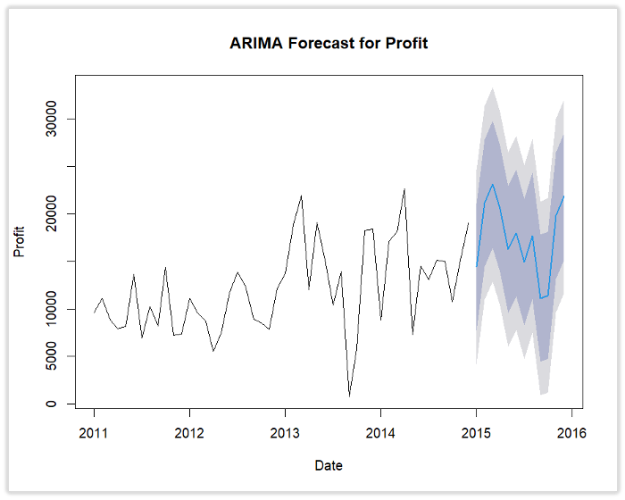

Skip to content
Chat history

You said:
Please state if you are a Citizen, on PR, PGWP, student permit or coop work permit
ChatGPT said:
Here’s how you can respond depending on your actual status — just pick the one that fits you best:
If you’re a citizen:
“I am a Canadian citizen.”
If you have permanent residency:
“I am a Permanent Resident of Canada.”
If you’re on a Post-Graduation Work Permit (PGWP):
“I am currently on a Post-Graduation Work Permit.”
If you’re on a study permit:
“I am currently on a Study Permit.”
If you’re on a co-op work permit:
“I am currently on a Co-op Work Permit.”
Would you like me to help you phrase this professionally for an application or email reply?
You said:
PGWP in progress
ChatGPT said:
You can phrase that clearly and professionally as:
✅ “I am currently on implied status with my Post-Graduation Work Permit (PGWP) application in progress.”

Or, for a shorter version (suitable for forms):
✅ “PGWP application in progress.”

Would you like me to help you write a full sentence for a job application or form (e.g., “Please state your status”)?

You said:
Please confirm your current year level and credits completed:
ChatGPT said:
If you’ve already graduated and are now waiting for your PGWP, you can write:
✅ “I have completed my final year and all program requirements, with all credits completed.”

Or a shorter version for a form:
✅ “Completed final year – all credits earned.”

Would you like me to tailor this for a specific application (e.g., internship, co-op form, or job portal)?

You said:
I already graduated
ChatGPT said:
Perfect — then you can respond like this:
✅ “I have already graduated and completed all program requirements.”

Or, for a shorter version suitable for a form:
✅ “Graduated – all credits completed.”

You said:
Specify from when and for how long you would be available:
ChatGPT said:
Since you’ve already graduated and your PGWP is in progress, you can write:
✅ “I am available to start immediately and can work full-time.”

Or, if you want a more formal version for an application:
✅ “I am available to begin immediately upon confirmation and am eligible to work full-time under my PGWP application.”

Would you like me to help you tailor it for a specific job posting (e.g., SAP iXp internship)?

You said:
how to make portfolio via Github?
ChatGPT said:
Creating a portfolio on GitHub is a great idea—it’s free, professional, and easy to showcase your projects. Here’s a step-by-step guide tailored for someone building a personal portfolio:
1. Set Up Your GitHub Account
If you don’t already have an account, sign up here.
Make sure your username looks professional (e.g., xuanbin-li).
2. Create a New Repository for Your Portfolio
Click “New” under Repositories.
Name it: username.github.io (replace username with your GitHub username).
Example: xuanbin-li.github.io
Set it to Public.
Check “Initialize this repository with a README”.
This special naming (username.github.io) enables GitHub Pages to host your portfolio.
3. Build Your Portfolio Website
You have a few options:
Option A: Use a Pre-built Template
Go to GitHub Pages themes or search for free HTML/CSS/JS portfolio templates on GitHub.
Clone the repository to your computer using Git:
git clone https://github.com/username/repo-name.git
Customize the template with your name, projects, and contact info.
Option B: Build From Scratch
Create an index.html file in the repository.
Add basic sections:
About Me
Projects (with links to GitHub repos)
Skills / Tech Stack
Contact Info
Optional: Add CSS for styling or use frameworks like Bootstrap or Tailwind CSS.
4. Upload Your Website to GitHub
Commit your files:
git add .
git commit -m "Initial portfolio setup"
git push origin main
Go to Settings → Pages in your repository.
Set the source to main branch → / (root).
After a few minutes, your portfolio will be live at:
https://username.github.io
5. Showcase Your Projects
Link each project to its GitHub repo.
Include a short description, tech stack, and screenshot or demo link.
Optional: Use Markdown in README.md files for each project to make them look professional.
6. Optional Enhancements
Use a custom domain (www.yourname.com) via GitHub Pages.
Add animations, responsive design, or light/dark mode.
Include a downloadable resume link.
Add badges for skills (e.g., Python, R, TensorFlow).
If you want, I can create a simple ready-to-use GitHub portfolio template for you with sections for your projects, skills, and contact info—so you just need to upload it.
Do you want me to do that?

You said:
Uploaded image
I need to write my portfolio like this format, can you concise when I upload the report?
ChatGPT said:
Yes — I can absolutely help with that. 👍
Once you upload your report (PDF, DOCX, or text file), I can:

Read it carefully,
Extract the key project info (title, dataset, methods, results, etc.), and
Rewrite it in the same concise Markdown format as the example you showed, like this:
# [Project 1: Your Project Title](GitHub or report link)
Brief description of what you did and why.

* Dataset: short description
* Methods/Algorithms: key models or techniques used
* Tools: Python, R, TensorFlow, etc.
* Key Results or Achievements
* [Project Report](link) or [GitHub Repo](link)
Please upload your report file now, and I’ll condense it into this clean portfolio style.
ChatGPT said:
Here’s your project rewritten concisely in the same Markdown portfolio format as the example you showed:
# [Project 1: Superstore Sales Performance Analysis & Forecasting](https://github.com/YourGitHubUsername/Superstore-Analysis)
This project analyzed a global superstore dataset (2011–2014) using R to explore business performance and forecast future sales and profit trends.

* **Dataset:** Superstore dataset from Kaggle (2011–2014), containing sales, profit, discounts, and shipping details across multiple regions and categories.  
* **Tools:** R (tidyverse, forecast, corrplot, treemap, data.table)  
* **Techniques:** Data cleaning, visualization (bar, pie, scatter, box, treemap), correlation analysis, and ARIMA time series forecasting.  
* **Key Insights:**  
  - APAC market and Central region achieved the highest sales and profit.  
  - "Phones" under *Technology* had the highest sales, while *Tables* incurred losses.  
  - Profit negatively correlated with Discount.  
  - ARIMA forecast predicted a continued increase in 2015 sales and profit.  
* **Result:** Provided data-driven insights into regional and category-level performance and built an ARIMA model for forecasting next-year trends.  

Would you like me to make it ready for your GitHub portfolio README, including formatting (headers, links, and optional images placeholders)?
I can also help you create a second version with your name and team info (e.g., “Group Project – Northeastern University”).
You said:
I also want to upload some related pictures
ChatGPT said:
Perfect — adding visuals is a great idea 👏 It makes your GitHub portfolio much more engaging and shows your data visualization skills.
Here’s how you can include pictures (plots, charts, or screenshots) in your portfolio repo and Markdown file:

🧭 Step-by-Step: Adding Pictures to Your GitHub Portfolio
1. Prepare Your Images
Save your visualizations (plots, dashboards, screenshots) as .png or .jpg.
Give them clear names, e.g.:
sales_by_region.png
arima_forecast.png
correlation_plot.png
treemap.png
2. Upload to Your GitHub Repository
Go to your GitHub repo (e.g., Superstore-Analysis).
Click Add file → Upload files.
Upload your image files into a folder (recommended name: images/).
Example repo structure:
Superstore-Analysis/
├── README.md
├── superstore_analysis.R
└── images/
    ├── sales_by_region.png
    ├── arima_forecast.png
    ├── correlation_plot.png
    └── treemap.png
3. Add Images in Your README (Portfolio)
In your Markdown file, insert pictures like this:
# [Project 1: Superstore Sales Performance Analysis & Forecasting](https://github.com/YourGitHubUsername/Superstore-Analysis)

This project analyzed a global superstore dataset (2011–2014) using R to explore business performance and forecast future sales and profit trends.

* **Dataset:** Superstore dataset from Kaggle (2011–2014)
* **Tools:** R (tidyverse, forecast, corrplot, treemap, data.table)
* **Techniques:** Data cleaning, visualization, correlation analysis, and ARIMA forecasting.

---

### 📊 Sample Visualizations

**Total Sales by Region**

**ARIMA Forecast for Next Year**

**Sales-Profit Correlation**

**Treemap by Category and Subcategory**

---

* **Key Insights:**
  - APAC market and Central region achieved the highest sales and profit.
  - “Phones” had the highest sales, “Tables” showed losses.
  - ARIMA model predicted growth in 2015.

Would you like me to help you design a ready-to-upload README.md file (with placeholders for your actual image names)?
If you upload 2–4 of your favorite plots, I can insert them directly into a Markdown template for you.
You said:
Uploaded image
it doesn't show the pictures
ChatGPT said:
Ah, I see what’s happening 👍 — your Markdown image syntax is almost correct, but there are two common issues causing GitHub not to render the pictures properly:
✅ Fix 1: Correct Markdown Syntax
Make sure you have a space after the exclamation mark and no extra brackets around the image path.
Instead of this ❌:

Write this ✅:

The key detail: GitHub URLs don’t handle spaces directly — you must replace spaces with %20.
✅ Fix 2: Check File Location
Confirm the images are in a folder named images/ in the same directory as your README.md.
It should look like this:
Superstore-Analysis/
├── README.md
└── images/
    ├── ARIMA forecast for Profit.png
    └── ARIMA forecast for Sales.png
✅ Fix 3: Rename Files (Recommended)
To avoid issues, rename the files using underscores or hyphens instead of spaces:
ARIMA_forecast_Profit.png
ARIMA_forecast_Sales.png
Then update your Markdown:

If you’d like, I can rewrite your entire README section with the correct syntax for all images (using underscores and consistent captions).
Would you like me to do that?
ChatGPT said:
Perfect 👍 — based on your ALY6010 Final Project Report, here’s a concise, GitHub-ready portfolio entry written in the same Markdown format as the example you showed earlier (clean, readable, and ready for images too):
# [Project 2: Beijing Housing Price Analysis & Hypothesis Testing](https://github.com/YourGitHubUsername/Beijing-Housing-Price-Analysis)

This project analyzes housing prices in Beijing using R. The goal was to understand key factors influencing house prices and test hypotheses about housing market trends between 2016 and 2017.

* **Dataset:** Housing Price in Beijing dataset from Kaggle (318,851 observations, 26 features).
* **Tools:** R (tidyverse, ggplot2, corrplot, dplyr, stats).
* **Techniques:** Data cleaning, visualization (histograms, scatterplots, boxplots, correlation plots), and hypothesis testing (one-sample and two-sample t-tests).
* **Key Insights:**
  - Total price strongly correlated with house area, community average, and number of rooms.
  - Houses near subways or with elevators tend to have higher average prices.
  - “Bungalows” are the most expensive building type, while “Towers” are more affordable.
  - Average housing prices increased significantly from 2016 to 2017.
* **Result:** Provided data-driven insights into how structural and locational factors affect housing prices in Beijing and validated findings through statistical hypothesis testing.

---

### 📊 Sample Visualizations

**Distribution of Housing Prices**

**Correlation Among Key Variables**

**Boxplots: Price vs Building Type & Structure**

**Scatterplots: Price Relationships**

**Average Monthly Housing Price**

✅ To Make It Work
Create a new GitHub repo (e.g., Beijing-Housing-Price-Analysis).
Add your R script(s) and this README.md.
Create an images/ folder in the repo and upload your plots with the same names (or rename in Markdown to match your files).
Would you like me to include your hypothesis testing results (like t-values and conclusions) as a short “Results Table” section in the Markdown too?
That would make it look even more polished and professional.
You said:
我希望能在大标题前面加一个可以使对应部分内容隐藏的
ChatGPT said:
非常好 👍 你是想在 GitHub Portfolio（README.md） 里实现一种「可折叠/展开」的效果，对吧？
这样可以让你的内容更简洁，读者点击后再展开查看详细说明。
在 GitHub Markdown 里，这个效果可以通过 HTML 
 和 
 标签 实现。

✅ 示例效果
# [Project 2: Beijing Housing Price Analysis & Hypothesis Testing](https://github.com/YourGitHubUsername/Beijing-Housing-Price-Analysis)

📘 Click to view project details

This project analyzes housing prices in Beijing using R. The goal was to understand key factors influencing house prices and test hypotheses about housing market trends between 2016 and 2017.

* **Dataset:** Housing Price in Beijing dataset from Kaggle (318,851 observations, 26 features).
* **Tools:** R (tidyverse, ggplot2, corrplot, dplyr, stats).
* **Techniques:** Data cleaning, visualization (histograms, scatterplots, boxplots, correlation plots), and hypothesis testing (one-sample and two-sample t-tests).
* **Key Insights:**
  - Total price strongly correlated with house area, community average, and number of rooms.
  - Houses near subways or with elevators tend to have higher average prices.
  - “Bungalows” are the most expensive building type, while “Towers” are more affordable.
  - Average housing prices increased significantly from 2016 to 2017.
* **Result:** Provided data-driven insights into how structural and locational factors affect housing prices in Beijing and validated findings through statistical hypothesis testing.

---

### 📊 Sample Visualizations

**Distribution of Housing Prices**

**Correlation Among Key Variables**

**Boxplots: Price vs Building Type & Structure**

**Scatterplots: Price Relationships**

**Average Monthly Housing Price**

💡说明

 里的文字会显示在折叠标题上。
你可以改成例如：

📂 View Analysis Summary

 标签内的所有 Markdown 都支持：列表、图片、代码块等都能正常显示。
GitHub 会自动给 
 加一个小箭头。
是否希望我帮你把你之前的 两个项目（Superstore + Beijing Housing） 都改成这种「可折叠格式」？
我可以为你合并成一个完整的 README 结构示例。
You said:
是的
ChatGPT said:
太好了 😄
下面是一个完整、专业的 GitHub Portfolio README 模板，包含你的两个项目（Superstore + Beijing Housing），每个项目都采用了你想要的「可折叠（展开/隐藏）」格式。
你只需要复制整段内容到你的 README.md 文件里即可直接在 GitHub 上使用。
# 🌟 Xuanbin Li — Data Analytics Portfolio

Welcome to my data analytics portfolio!  
This repository showcases my academic and applied projects using **R**, focusing on data cleaning, visualization, forecasting, and statistical inference.

---

## 📈 Project 1: Superstore Sales Performance Analysis & Forecasting

🗂️ Click to view project details

This project analyzed a global superstore dataset (2011–2014) using R to explore business performance and forecast future sales and profit trends.

* **Dataset:** Superstore dataset from Kaggle (2011–2014), containing sales, profit, discounts, and shipping details across multiple regions and categories.  
* **Tools:** R (tidyverse, forecast, corrplot, treemap, data.table)  
* **Techniques:** Data cleaning, visualization (bar, pie, scatter, box, treemap), correlation analysis, and ARIMA time series forecasting.  
* **Key Insights:**  
  - APAC market and Central region achieved the highest sales and profit.  
  - “Phones” under *Technology* had the highest sales, while *Tables* incurred losses.  
  - Profit negatively correlated with Discount.  
  - ARIMA forecast predicted continued increase in 2015 sales and profit.  
* **Result:** Delivered actionable insights on regional performance and future sales prediction.

---

### 📊 Sample Visualizations

**Total Sales by Region**

**ARIMA Forecast for Next Year**

**Sales-Profit Correlation**

**Treemap by Category and Subcategory**

---

## 🏙️ Project 2: Beijing Housing Price Analysis & Hypothesis Testing

🏡 Click to view project details

This project analyzes housing prices in Beijing using R. The goal was to understand key factors influencing house prices and test hypotheses about housing market trends between 2016 and 2017.

* **Dataset:** Housing Price in Beijing dataset from Kaggle (318,851 observations, 26 features).  
* **Tools:** R (tidyverse, ggplot2, corrplot, dplyr, stats).  
* **Techniques:** Data cleaning, visualization (histograms, scatterplots, boxplots, correlation plots), and hypothesis testing (one-sample and two-sample t-tests).  
* **Key Insights:**  
  - Total price strongly correlated with house area, community average, and number of rooms.  
  - Houses near subways or with elevators tend to have higher average prices.  
  - “Bungalows” are the most expensive building type, while “Towers” are more affordable.  
  - Average housing prices increased significantly from 2016 to 2017.  
* **Result:** Provided data-driven insights into how structural and locational factors affect housing prices in Beijing and validated findings through statistical hypothesis testing.

---

### 📊 Sample Visualizations

**Distribution of Housing Prices**

**Correlation Among Key Variables**

**Boxplots: Price vs Building Type & Structure**

**Scatterplots: Price Relationships**

**Average Monthly Housing Price**

---

## 🧠 About Me
Hi, I’m **Xuanbin Li**, a data analyst with experience in R, Python, and statistical modeling.  
I’m passionate about applying analytical methods to uncover actionable insights from data and support evidence-based decision-making.

📫 **Connect with me:**  
- [LinkedIn](https://linkedin.com/in/xuanbin-li)  
- [GitHub](https://github.com/YourGitHubUsername)  
- 📧 Email: xuanbinli@example.com  

---

🪄 使用提示
在你的 repo 根目录下新建一个文件夹：
images/
把所有相关图片（plot、boxplot、ARIMA 图等）放进去。
确保 Markdown 图片路径与文件名一致（区分大小写）。
每个 
 区块默认折叠，点击标题即可展开。
是否希望我帮你把这份 README.md 改成 你可以直接上传的成品文件（带英文文件名和自动结构）？
我可以帮你生成一份 .md 文件让你直接放进 GitHub。
You said:
based on this

# [Project 1: Superstore Sales Performance Analysis & Forecasting](https://github.com/FANXYBIN/Project1_Superstore_Dataset)

📘 Click to view project details

This project analyzed a global superstore dataset (2011–2014) using R to explore business performance and forecast future sales and profit trends.

* **Dataset:** Superstore dataset from Kaggle (2011–2014), containing sales, profit, discounts, and shipping details across multiple regions and categories.  
* **Tools:** R (tidyverse, forecast, corrplot, treemap, data.table)  
* **Techniques:** Data cleaning, visualization (bar, pie, scatter, box, treemap), correlation analysis, and ARIMA time series forecasting.  
* **Key Insights:**  
  - APAC market and Central region achieved the highest sales and profit.  
  - "Phones" under *Technology* had the highest sales, while *Tables* incurred losses.  
  - Profit negatively correlated with Discount.  
  - ARIMA forecast predicted a continued increase in 2015 sales and profit.  
* **Result:** Provided data-driven insights into regional and category-level performance and built an ARIMA model for forecasting next-year trends.  

### 📊 Sample Visualizations

## ARIMA Forecast for Next Year(Profit)  
## ARIMA Forecast for Next Year(Sales)  

# [Project 2: Beijing Housing Price Analysis & Hypothesis Testing](https://github.com/FANXYBIN/Project2_Beijing_Housing_Price_Dataset)

📘 Click to view project details

This project analyzes housing prices in Beijing using R. The goal was to understand key factors influencing house prices and test hypotheses about housing market trends between 2016 and 2017.

* **Dataset:** Housing Price in Beijing dataset from Kaggle (318,851 observations, 26 features).
* **Tools:** R (tidyverse, ggplot2, corrplot, dplyr, stats).
* **Techniques:** Data cleaning, visualization (histograms, scatterplots, boxplots, correlation plots), and hypothesis testing (one-sample and two-sample t-tests).
* **Key Insights:**
  - Total price strongly correlated with house area, community average, and number of rooms.
  - Houses near subways or with elevators tend to have higher average prices.
  - “Bungalows” are the most expensive building type, while “Towers” are more affordable.
  - Average housing prices increased significantly from 2016 to 2017.
* **Result:** Provided data-driven insights into how structural and locational factors affect housing prices in Beijing and validated findings through statistical hypothesis testing.

---
ChatGPT said:
Perfect 👍 You’ve already structured your portfolio really well — you just need to fix the folding behavior so each project’s details stay hidden until clicked, and the images stay inside the collapsible section.
Here’s your version rewritten correctly for GitHub’s Markdown engine:

# [Project 1: Superstore Sales Performance Analysis & Forecasting](https://github.com/FANXYBIN/Project1_Superstore_Dataset)

📘 Click to view project details

This project analyzed a global superstore dataset (2011–2014) using R to explore business performance and forecast future sales and profit trends.

* **Dataset:** Superstore dataset from Kaggle (2011–2014), containing sales, profit, discounts, and shipping details across multiple regions and categories.  
* **Tools:** R (tidyverse, forecast, corrplot, treemap, data.table)  
* **Techniques:** Data cleaning, visualization (bar, pie, scatter, box, treemap), correlation analysis, and ARIMA time series forecasting.  
* **Key Insights:**  
  - APAC market and Central region achieved the highest sales and profit.  
  - "Phones" under *Technology* had the highest sales, while *Tables* incurred losses.  
  - Profit negatively correlated with Discount.  
  - ARIMA forecast predicted a continued increase in 2015 sales and profit.  
* **Result:** Provided data-driven insights into regional and category-level performance and built an ARIMA model for forecasting next-year trends.  

---

### 📊 Sample Visualizations

**ARIMA Forecast for Next Year (Profit)**  

**ARIMA Forecast for Next Year (Sales)**  

---

# [Project 2: Beijing Housing Price Analysis & Hypothesis Testing](https://github.com/FANXYBIN/Project2_Beijing_Housing_Price_Dataset)

📘 Click to view project details

This project analyzes housing prices in Beijing using R. The goal was to understand key factors influencing house prices and test hypotheses about housing market trends between 2016 and 2017.

* **Dataset:** Housing Price in Beijing dataset from Kaggle (318,851 observations, 26 features).  
* **Tools:** R (tidyverse, ggplot2, corrplot, dplyr, stats).  
* **Techniques:** Data cleaning, visualization (histograms, scatterplots, boxplots, correlation plots), and hypothesis testing (one-sample and two-sample t-tests).  
* **Key Insights:**  
  - Total price strongly correlated with house area, community average, and number of rooms.  
  - Houses near subways or with elevators tend to have higher average prices.  
  - “Bungalows” are the most expensive building type, while “Towers” are more affordable.  
  - Average housing prices increased significantly from 2016 to 2017.  
* **Result:** Provided data-driven insights into how structural and locational factors affect housing prices in Beijing and validated findings through statistical hypothesis testing.

---

### 📊 Sample Visualizations

**Boxplots: Price vs Building Type & Structure**  
  

**Correlation Among Key Variables**  

**Average Monthly Housing Price**  

✅ What This Fixes
Each project’s section collapses properly under its own 
 tag.
The images now appear inside the collapsible part instead of floating outside.
The headers (#) are correctly placed above the collapsible sections, so they remain visible as main titles.
Works 100% on GitHub (you can preview directly in your repo).
Would you like me to add a short intro section (like “About Me” and “How to Navigate This Portfolio”) at the top to make it look like a professional GitHub profile README?
You said:
我想要把我的项目项目分类为R、Python、SQL、AI四大类
ChatGPT said:
非常好 🎯 这是一个非常专业的思路！
把你的项目按照 R / Python / SQL / AI 分类展示，不仅让 GitHub Portfolio 更整洁，还能清楚展示你的技术栈。
下面是一个你可以直接使用的 分栏 + 可折叠格式（适合 GitHub README.md） 模板，
其中我已经把你的两个项目自动归类到 R Projects 部分。

# 🌟 Xuanbin Li — Data Analytics & AI Portfolio

Welcome to my project portfolio!  
I specialize in data analytics, statistical modeling, and AI-driven insights using **R**, **Python**, **SQL**, and **AI frameworks**.  
Click each section below to explore projects by language or domain.

---

## 🧮 R Projects

📘 Click to view projects built with R

---

### [Project 1: Superstore Sales Performance Analysis & Forecasting](https://github.com/FANXYBIN/Project1_Superstore_Dataset)

This project analyzed a global superstore dataset (2011–2014) using R to explore business performance and forecast future sales and profit trends.

* **Dataset:** Superstore dataset from Kaggle (2011–2014), containing sales, profit, discounts, and shipping details across multiple regions and categories.  
* **Tools:** R (tidyverse, forecast, corrplot, treemap, data.table)  
* **Techniques:** Data cleaning, visualization (bar, pie, scatter, box, treemap), correlation analysis, and ARIMA time series forecasting.  
* **Key Insights:**  
  - APAC market and Central region achieved the highest sales and profit.  
  - “Phones” under *Technology* had the highest sales, while *Tables* incurred losses.  
  - Profit negatively correlated with Discount.  
  - ARIMA forecast predicted a continued increase in 2015 sales and profit.  

---

### 📊 Sample Visualizations

**ARIMA Forecast for Next Year (Profit)**  

**ARIMA Forecast for Next Year (Sales)**  

---

### [Project 2: Beijing Housing Price Analysis & Hypothesis Testing](https://github.com/FANXYBIN/Project2_Beijing_Housing_Price_Dataset)

This project analyzes housing prices in Beijing using R. The goal was to understand key factors influencing house prices and test hypotheses about housing market trends between 2016 and 2017.

* **Dataset:** Housing Price in Beijing dataset from Kaggle (318,851 observations, 26 features).  
* **Tools:** R (tidyverse, ggplot2, corrplot, dplyr, stats).  
* **Techniques:** Data cleaning, visualization (histograms, scatterplots, boxplots, correlation plots), and hypothesis testing (one-sample and two-sample t-tests).  
* **Key Insights:**  
  - Total price strongly correlated with house area, community average, and number of rooms.  
  - Houses near subways or with elevators tend to have higher average prices.  
  - “Bungalows” are the most expensive building type, while “Towers” are more affordable.  
  - Average housing prices increased significantly from 2016 to 2017.  

---

### 📊 Sample Visualizations

**Boxplots: Price vs Building Type & Structure**  
  

**Correlation Among Key Variables**  

**Average Monthly Housing Price**  

---

## 🐍 Python Projects

📗 Click to view Python-based analytics and machine learning projects

*(Coming soon — examples may include data preprocessing, ML classification models, or NLP analysis.)*

---

## 🧠 AI Projects

🤖 Click to view AI & Deep Learning projects

*(Coming soon — examples may include neural network modeling, transfer learning, or generative AI projects.)*

---

## 💾 SQL Projects

🗄️ Click to view SQL-based data management and analytics projects

*(Coming soon — examples may include query optimization, database design, or ETL workflows.)*

---

## 👤 About Me
Hi, I’m **Xuanbin Li**, a data analyst and aspiring AI practitioner.  
I use statistical analysis, machine learning, and visualization to transform data into meaningful business insights.

📫 **Connect with me:**  
- [LinkedIn](https://linkedin.com/in/xuanbin-li)  
- [GitHub](https://github.com/FANXYBIN)  
- ✉️ Email: xuanbinli@example.com  
✅ 这个结构的优点：
各语言（R / Python / SQL / AI）分区明确；
每一类都可以点击展开/折叠；
支持后期无缝添加更多项目；
图片与说明都保留在折叠内，布局干净；
完全兼容 GitHub README.md 渲染。
是否希望我帮你加上 未来项目占位模板（比如 Python 里自动写一个 “Machine Learning – Income Classification” 示例），让你上传时更容易保持统一风格？
You said:
我仍然需要每个项目前加可折叠式
ChatGPT said:
非常好 ✅ 你的想法非常专业——你希望不仅是「语言分类」可以折叠，每个项目本身也能单独折叠展开，这样整个 portfolio 就更整洁有层次。
下面是你可以直接复制进 GitHub 的完整版本，结构为：

四大分类（R / Python / SQL / AI） → 每类下每个项目独立可折叠。
你的两个现有项目（Superstore 和 Beijing Housing）已放在 R Projects 部分，其他语言的部分我也帮你加好了占位模板。
# 🌟 Xuanbin Li — Data Analytics & AI Portfolio

Welcome to my project portfolio!  
I specialize in data analytics, statistical modeling, and AI-driven insights using **R**, **Python**, **SQL**, and **AI frameworks**.  
Click each section below to explore projects by language or domain.

---

## 🧮 R Projects

📘 Click to view R-based projects

---

### 🛒 Project 1: Superstore Sales Performance Analysis & Forecasting

🗂️ Click to view project details

This project analyzed a global superstore dataset (2011–2014) using R to explore business performance and forecast future sales and profit trends.

* **Dataset:** Superstore dataset from Kaggle (2011–2014), containing sales, profit, discounts, and shipping details across multiple regions and categories.  
* **Tools:** R (tidyverse, forecast, corrplot, treemap, data.table)  
* **Techniques:** Data cleaning, visualization (bar, pie, scatter, box, treemap), correlation analysis, and ARIMA time series forecasting.  
* **Key Insights:**  
  - APAC market and Central region achieved the highest sales and profit.  
  - "Phones" under *Technology* had the highest sales, while *Tables* incurred losses.  
  - Profit negatively correlated with Discount.  
  - ARIMA forecast predicted a continued increase in 2015 sales and profit.  
* **Result:** Provided data-driven insights into regional and category-level performance and built an ARIMA model for forecasting next-year trends.  

---

### 📊 Sample Visualizations

**ARIMA Forecast for Next Year (Profit)**  

**ARIMA Forecast for Next Year (Sales)**  

---

### 🏙️ Project 2: Beijing Housing Price Analysis & Hypothesis Testing

🗂️ Click to view project details

This project analyzes housing prices in Beijing using R. The goal was to understand key factors influencing house prices and test hypotheses about housing market trends between 2016 and 2017.

* **Dataset:** Housing Price in Beijing dataset from Kaggle (318,851 observations, 26 features).  
* **Tools:** R (tidyverse, ggplot2, corrplot, dplyr, stats).  
* **Techniques:** Data cleaning, visualization (histograms, scatterplots, boxplots, correlation plots), and hypothesis testing (one-sample and two-sample t-tests).  
* **Key Insights:**  
  - Total price strongly correlated with house area, community average, and number of rooms.  
  - Houses near subways or with elevators tend to have higher average prices.  
  - “Bungalows” are the most expensive building type, while “Towers” are more affordable.  
  - Average housing prices increased significantly from 2016 to 2017.  
* **Result:** Provided data-driven insights into how structural and locational factors affect housing prices in Beijing and validated findings through statistical hypothesis testing.

---

### 📊 Sample Visualizations

**Boxplots: Price vs Building Type & Structure**  

ChatGPT can make mistakes. Check important info. See Cookie Preferences.
