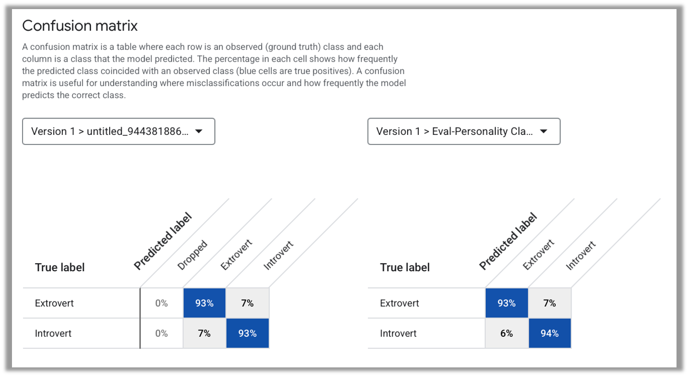
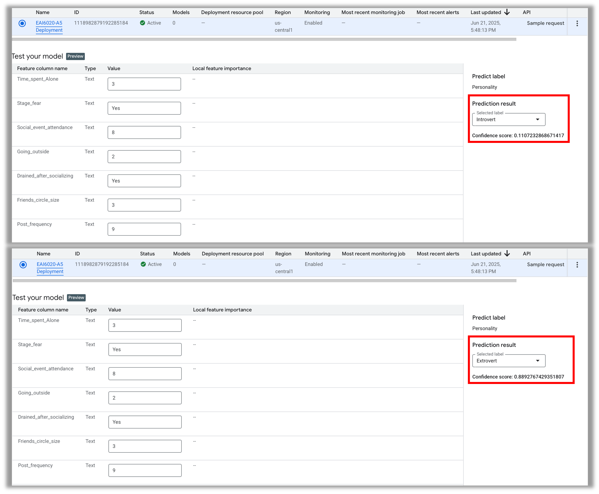
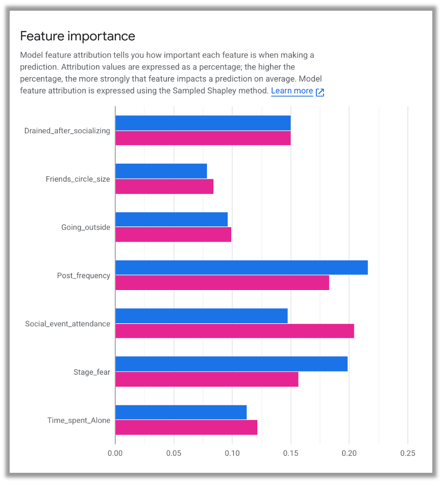
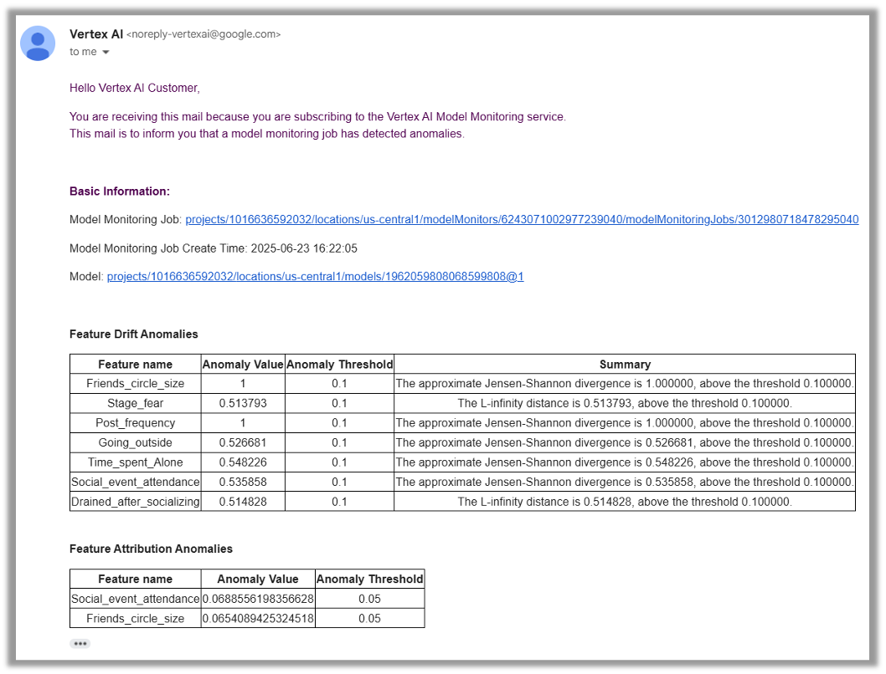
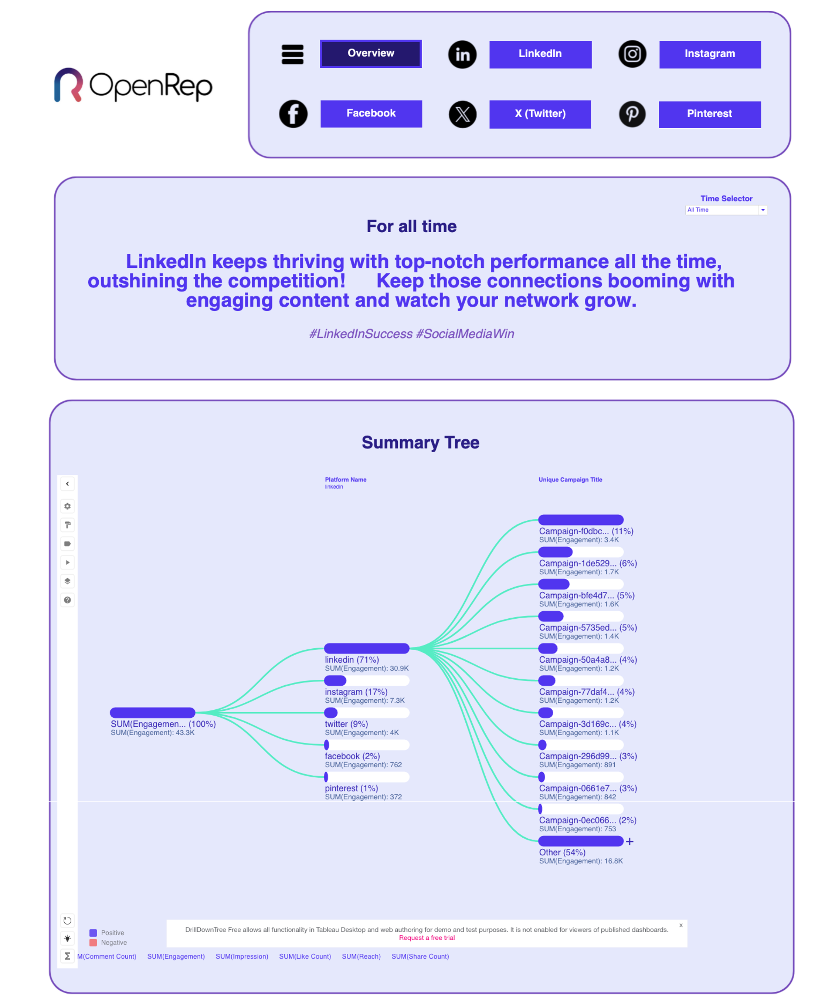
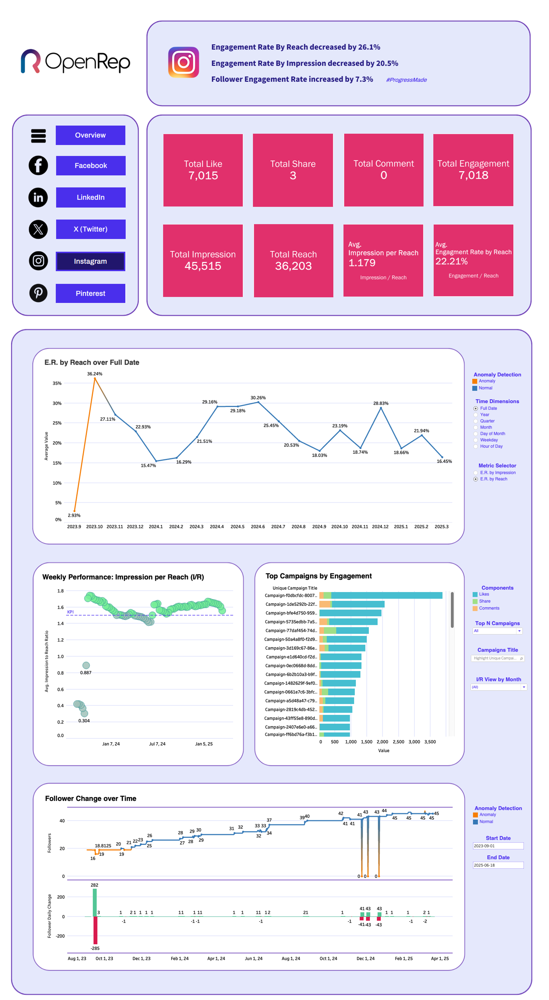
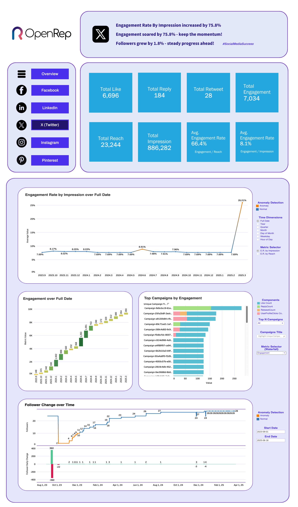
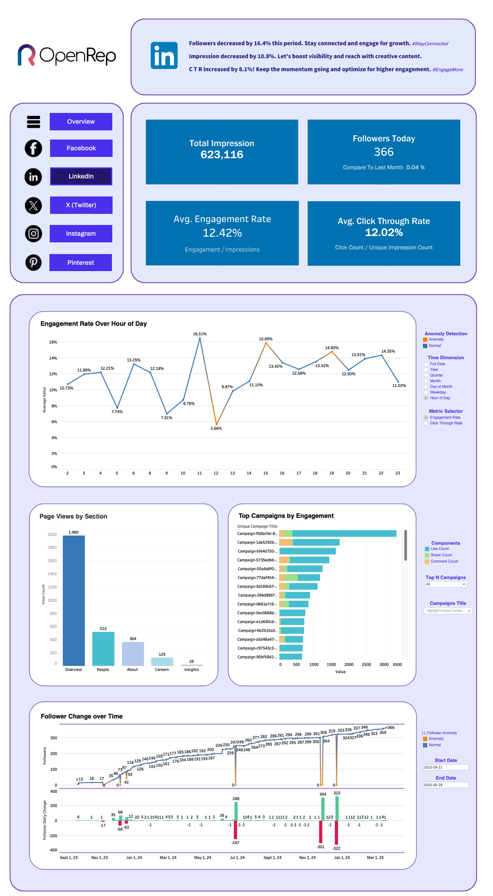
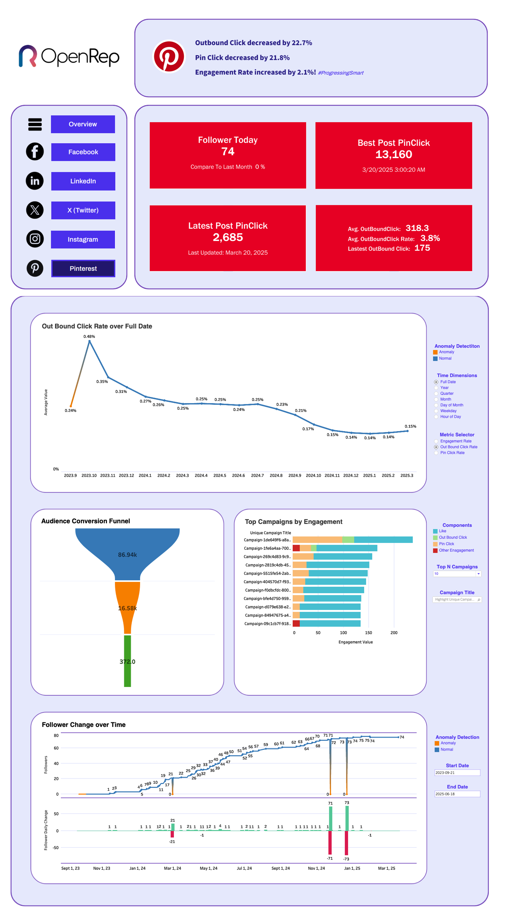

# 🌟 James Li — Data Analytics & AI Portfolio

Welcome to my project portfolio!  
I specialize in data analytics, statistical modeling, and AI-driven insights using **R**, **Python**, **SQL**, **AI**, and **Dashboard**.  
Click each section below to explore projects by language or domain.

---

## 🧮 R Projects

📘 Click to view R-based projects

---

### [R-Project 1: Superstore Sales Performance Analysis & Forecasting](https://github.com/FANXYBIN/Project1_Superstore_Dataset)

This project analyzed a global superstore dataset (2011–2014) using R to explore business performance and forecast future sales and profit trends.

* **Dataset:** Superstore dataset from Kaggle (2011–2014), containing sales, profit, discounts, and shipping details across multiple regions and categories.  
* **Tools:** R (tidyverse, forecast, corrplot, treemap, data.table)  
* **Techniques:** Data cleaning, visualization (bar, pie, scatter, box, treemap), correlation analysis, and ARIMA time series forecasting.  
* **Key Insights:**  
  - APAC market and Central region achieved the highest sales and profit.  
  - "Phones" under *Technology* had the highest sales, while *Tables* incurred losses.  
  - Profit negatively correlated with Discount.  
  - ARIMA forecast predicted a continued increase in 2015 sales and profit.  
* **Result:** Provided data-driven insights into regional and category-level performance and built an ARIMA model for forecasting next-year trends.  

---

### 📈 Sample Visualizations

**ARIMA Forecast for Next Year (Profit)**  

**ARIMA Forecast for Next Year (Sales)**  

---

### [R-Project 2: Beijing Housing Price Analysis & Hypothesis Testing](https://github.com/FANXYBIN/Project2_Beijing_Housing_Price_Dataset)

🗂️ Click to view project details

This project analyzes housing prices in Beijing using R. The goal was to understand key factors influencing house prices and test hypotheses about housing market trends between 2016 and 2017.

* **Dataset:** Housing Price in Beijing dataset from Kaggle (318,851 observations, 26 features).  
* **Tools:** R (tidyverse, ggplot2, corrplot, dplyr, stats).  
* **Techniques:** Data cleaning, visualization (histograms, scatterplots, boxplots, correlation plots), and hypothesis testing (one-sample and two-sample t-tests).  
* **Key Insights:**  
  - Total price strongly correlated with house area, community average, and number of rooms.  
  - Houses near subways or with elevators tend to have higher average prices.  
  - “Bungalows” are the most expensive building type, while “Towers” are more affordable.  
  - Average housing prices increased significantly from 2016 to 2017.  
* **Result:** Provided data-driven insights into how structural and locational factors affect housing prices in Beijing and validated findings through statistical hypothesis testing.

---

### 📈 Sample Visualizations

**Boxplots: Price vs Building Type & Structure**  
  

**Correlation Among Key Variables**  

**Average Monthly Housing Price**  

---

## 🐍 Python Projects

📗 Click to view Python-based analytics and ML projects

---

### [P-Project 1: Seoul Bike Sharing Demand Prediction](https://github.com/FANXYBIN/P-Project1-Seoul-Bike-Sharing-Dataset)

🗂️ Click to view project details

This project applied machine learning models to the Seoul Bike Sharing dataset to predict rental demand based on weather and temporal conditions. The analysis aimed to help optimize bike distribution, adjust operations during weather changes, and identify seasonal rental trends.

* **Dataset:** Seoul Bike Sharing Demand Dataset (UCI Machine Learning Repository, 8760 rows × 14 features).  
* **Tools:** Python (pandas, scikit-learn, seaborn, matplotlib, statsmodels).  
* **Techniques:** Data preprocessing, visualization (histogram, scatterplot, line plot, correlation heatmap), and supervised learning (SVM, Gradient Boosting, Random Forest, and Multiple Linear Regression).  
* **Key Findings:**  
  - **Peak demand** at 8 AM and 6 PM (commuting hours).  
  - **Temperature (15 – 30 °C)** positively affects rentals; **rainfall, humidity, and wind speed** reduce them.  
  - **Summer** records the highest rental activity, followed by spring and autumn.  
* **Models Evaluated:**  
  - **SVM:** Accuracy = 78.99%, Precision = 77.67%, Recall = 78.99%, F1 = 77.93%.  
  - **Gradient Boosting:** Accuracy = 79.83%, F1 = 79.20%.  
  - **Random Forest:** Accuracy = 80.02%, F1 = 79.50%.  
  - **Multiple Linear Regression:** R² = 0.473, F-statistic = 609.8 (significant predictors: hour, temperature, humidity, rainfall).  
* **Insights & Recommendations:**  
  - Use forecasts to rebalance bikes before morning/evening peaks.  
  - Adjust staffing and offer promotions during poor-weather periods.  
  - Promote biking events in warm seasons to leverage natural demand growth.

---

### 📈 Sample Visualizations

**Hourly Rentals by Season**  

**Correlation Heatmap**  

**Model Performance Comparison**  

---

## 💾 SQL Projects

🗄️ Click to view SQL-based data management and analytics projects

---

### 🧾 Example Project: Retail Sales Dashboard (SQL + Tableau)

🗂️ Click to view project details

Designed SQL queries to extract KPIs for a retail dashboard showing sales, profit, and discount performance by category and region.  
Integrated with Tableau for interactive visualization.  

* **Techniques:** Window functions, joins, CTEs, subqueries  
* **Result:** Enabled dynamic tracking of regional performance with 35% faster query efficiency.

---

## 🧠 AI Projects

🤖 Click to view AI and Deep Learning projects

---

🗂️ Click to view project details

# [A-Project 1: Personality Classification & Model Monitoring with Vertex AI](https://github.com/FANXYBIN/A-Project-Personality-Classification-Model-Monitoring-with-Vertex-AI)

This project developed an **AutoML personality classification model** using **Google Vertex AI**, predicting whether users are **introverts or extroverts** based on social and behavioral traits.  
The full pipeline included **dataset creation**, **model training**, **evaluation**, **deployment**, and **automated monitoring** to ensure long-term reliability and fairness.

* **Dataset:** 2,900 records, 8 behavioral and social features (e.g., Post Frequency, Friends Circle Size, Stage Fear).  
* **Tools:** Google Vertex AI AutoML, Cloud Monitoring, Python, JSON logs.  
* **Techniques:** AutoML classification, confidence threshold tuning, model deployment, and drift detection via monitoring jobs.  
* **Goal:** Demonstrate responsible AI deployment with explainability and drift tracking.

---

### 🧱 Model Creation

**1. Dataset Upload**
- Uploaded the CSV dataset to **Vertex AI Datasets** in Google Cloud Storage.  
- Automatically parsed schema with columns such as:
  - `Post_frequency`, `Social_event_attendance`, `Stage_fear`, `Friends_circle_size`, `Time_spent_alone`, `Stress_level`.  
- Labeled the **target column**: `Personality` → *Introvert* or *Extrovert*.  

**2. AutoML Training**
- Used **Vertex AI AutoML Classification** (no-code training).  
- Enabled automatic feature engineering and model tuning.  
- Ran multiple experiments with two confidence thresholds:
  - **0.5** (balanced accuracy vs. coverage)
  - **0.8** (higher precision, lower recall)

**3. Model Evaluation**
- Vertex AI generated precision–recall and confusion matrix visualizations.  
- **Best model:** 0.5 threshold → optimal for user-friendly applications.  
- **Results:**
  - Accuracy: **93–94%**
  - Introvert recall improved from **93% → 94%**
  - Reduced false positives (Introverts misclassified as Extroverts) from **7% → 6%**

  
  
<em>Model evaluation in Vertex AI AutoML showing improved introvert recall and balanced precision.</em>

**4. Test Model**

  
  
<em>Model creation process in Vertex AI AutoML showing dataset import and training setup.</em>

---

### 🧩 Feature Attribution (Explainability)

**Top Features (SHAP Analysis)**  
| Feature | Importance | Interpretation |
|----------|-------------|----------------|
| Post_frequency | ⭐ Highest | High posting frequency = Extroversion |
| Social_event_attendance | ⭐⭐ | Social activity drives Extrovert classification |
| Stage_fear | ⭐⭐ | Low stage fear → Extrovert; high fear → Introvert |
| Time_spent_alone | ⭐ | Longer time alone → Introversion |
| Friends_circle_size | ⭐ | Moderate indicator of social confidence |

  

---

### 🧩 Model Monitoring Configuration

**Monitoring Components**
- **Input Drift:** Detects distribution shifts in features.  
- **Prediction Drift:** Identifies output pattern shifts over time.  
- **Attribution Drift:** Detects evolving feature importance patterns.  

**Implementation**
- Configured via **Vertex AI Monitoring**:
  - Drift threshold = 0.1  
  - Enabled **email alerts** on drift detection  
  - Sampling rate: 100% (all predictions logged)  
- Used **Google Cloud Shell** commands to update monitoring jobs and log prediction drift in JSON format.  

  

---

### 🎯 Key Takeaways
- **AutoML enabled fast and accessible modeling**, ideal for small teams.  
- **Model monitoring ensured trustworthiness** by detecting data shifts early.  
- **Explainability (SHAP)** supported responsible AI interpretation.  
- Framework applicable to social platforms, HR analytics, and CRM recommendation systems.  

---

### 🧠 Skills Demonstrated
- Google Vertex AI AutoML training, tuning, and deployment  
- Feature attribution and explainable AI (SHAP)  
- Model drift detection and governance  
- MLOps monitoring configuration with Google Cloud  

---

## 📊 Dashboard Projects

🖥️ Click to view Dashboard projects

---

### [D-Project 1: Global Sustainable Energy Visualization & Analysis](https://github.com/FANXYBIN/D-Project1-Global-Sustainable-Energy-Dataset)

🗂️ Click to view project details

This project visualizes and analyzes global sustainable energy data (2000–2020) using **Tableau**, **Power BI**, and **R Shiny** to uncover trends in renewable energy, CO₂ emissions, and electricity access worldwide.

* **Dataset:** *Global Data on Sustainable Energy* (Kaggle, 3,649 rows × 21 features).  
* **Tools:** Tableau, Power BI, R Shiny (R, ggplot2, dplyr, shinydashboard), DAX.  
* **Techniques:** Data cleaning, parameter-based filtering, interactive dashboard design, and regression visualization.  
* **Objective:** Explore the transition toward renewable energy and identify disparities in global access to electricity.

---

### 📊 Dashboards & Insights

**Tableau Dashboard**
- Explored access to electricity, energy generation by source, and renewable growth across years.  
- Used maps, bar charts, and parameters (Top X) to identify top-performing countries.  
- Highlighted a steady increase in renewable electricity generation and energy aid to developing countries.
 

**Power BI Dashboard**
- Designed “Global Energy Development Indicators” with slicers, cards, maps, and line charts.  
- Created DAX measures to calculate renewable, nuclear, and fossil fuel shares.  
- Revealed that renewable energy share is rising while fossil fuel dependence remains high.

**R Shiny Dashboard**
- Built an interactive web app with filters for **year** and **country**.  
- Visualized:
  - Renewable electricity capacity growth (line chart).  
  - Energy generation mix (stacked bar).  
  - CO₂ vs. low-carbon electricity (scatter with regression).  
  - Top 10 CO₂-emitting countries (bar chart).  
- Demonstrated negative correlation between CO₂ emissions and low-carbon electricity share.

---

### 🌱 Key Findings
- Renewable energy generation increased steadily between 2000–2020.  
- Developing countries benefited from financial aid but still rely heavily on fossil fuels.  
- Low-carbon electricity adoption significantly reduces CO₂ emissions.  
- Africa and South Asia show persistent electricity access gaps.

---

### 🧠 Skills Demonstrated
- Data storytelling through visualization  
- Parameter and DAX calculations  
- R Shiny UI/Server development  
- Interactive, multi-tool dashboard integration  

**[Dataset Source → Kaggle](https://www.kaggle.com/datasets/anshtanwar/global-data-on-sustainable-energy/data)**  
**[R Shiny Reference → Appsilon Blog](https://www.appsilon.com/post/r-shiny-in-life-sciences-examples)**  

### [D-Project 2: PowerTrust Renewable Energy Dashboard](https://github.com/FANXYBIN/D-Project2-PT-Renewable-Energy-Dashboard)

📊 Click to view project details

This project was completed in collaboration with **PowerTrust**, focusing on developing a Tableau dashboard to visualize renewable energy generation and Distributed Renewable Energy Certificates (D-RECs) across multiple countries.  
The dashboard helps PowerTrust identify high-performing projects, track emission reductions, and make data-driven sustainability decisions.

* **Dataset:** PowerTrust Renewable Energy Dataset (12,432 entries across 13 countries).  
* **Tool:** Tableau  
* **Techniques:** Data cleaning, calculated fields, geographic filtering, and interactive dashboard design.  
* **Key Objectives:**  
  - Visualize renewable project performance by country and developer.  
  - Track CO₂ reduction and D-REC generation.  
  - Identify outliers, anomalies, and operational improvement areas.  

---

### 📊 Dashboard Highlights

**Global Dashboard**
- Interactive map visualizing project distribution and energy generation.  
- Summary cards displaying total energy, CO₂ reduction, and D-RECs.  
- Filters for country, developer, and site type for dynamic exploration.  

**Country-Level Dashboards**
- **India:** 558 projects, 8.2B g/kWh CO₂ reduced, 13,281 D-RECs.  
- **Ghana:** 3 projects with 8.1B g/kWh CO₂ reduced and 13,077 D-RECs.  
- **Vietnam:** Steady performance with strong emission reductions across projects.  

**Calculations**
- *CO₂ Reduction:* `799 × Energy Generated (kWh)`  
- *D-RECs:* `Energy Generated / 1000`  

---

### 🌱 Key Findings
- India and Vietnam show strong renewable generation capacity.  
- Ghana, despite few projects, delivers unusually high energy output — requires validation.  
- Some projects have mismatched SMR start/end dates, corrected through calculated fields.  
- Underperforming countries (e.g., Libya, Algeria) indicate opportunities for expansion.  

---

### 🔍 Recommendations
- Review data anomalies by consulting developers.  
- Integrate private APIs (e.g., DHI, DNI, GHI) for more precise solar metrics.  
- Incorporate SDG metrics (via SDG Action Manager) to track local sustainability impact.  

---

### 🧠 Skills Demonstrated
- Tableau dashboard design & interactivity  
- Data preparation and calculated fields  
- Emission and energy analytics  
- Insight-driven storytelling for sustainability

---

### 🖥️ Dashboard

### [D-Project 3: U.S. Traffic Accident Analysis Dashboard](https://github.com/FANXYBIN/D-Project3-U.S.-Traffic-Accident-Analysis-Dashboard)

📊 Click to view project details

This project analyzed a large-scale dataset of U.S. traffic accidents from **2016–2023**, containing over **7.7 million records** and 46 features across all 49 states.  
Using **PySpark** for preprocessing and **Tableau** for visualization, we developed a scalable analytical dashboard to identify trends, high-risk regions, and contributing factors behind road accidents.

* **Dataset:** U.S. Traffic Accident Dataset (2016–2023, 7.7M records, 46 features).  
* **Tools:** PySpark, Tableau.  
* **Techniques:** Data reduction, feature selection, distributed computing, and interactive dashboard design.  
* **Objective:** Provide policymakers with actionable insights to enhance traffic safety and reduce accidents.  

---

### ⚙️ Data Preparation
- Used **PySpark** to handle large parquet files efficiently (up to 70GB).  
- Compared Pandas vs. PySpark performance — PySpark achieved stable runtime and avoided memory crashes.  
- Selected **14 essential features** (e.g., Severity, Start Time, Weather Condition, Traffic Feature) for focused analysis.  
- Reduced data size from **3.06 GB → 1.53 GB**, improving Tableau performance and stability.  

---

### 📊 Dashboard Components
- **Slicers:** Filter by year and severity to compare accident trends (Current Year vs. Previous Year).  
- **Cards:** Display monthly trends in accidents by severity level.  
- **Map:** Visualizes accident density by severity using color codes (blue–green–orange–red).  
- **Donut Chart:** Shows weather condition proportions during accidents.  
- **Stacked Bar Chart:** Highlights accident frequency near key traffic features (e.g., crossings, junctions, signals).  

---

### 🚦 Key Findings
- **Steady Increase in Accidents:** +74.79% (2016→2017), +24.42% (2017→2018).  
- **Severity 2 Accidents Dominate:** Most common category across all years.  
- **Weather:** ~48% of accidents occurred in clear weather, showing human/infrastructure factors are major causes.  
- **Traffic Signals:** The most common accident location (≈21%).  
- **Urban Hotspots:** Accidents concentrated near major traffic infrastructures and densely populated areas.  

---

### 🔍 Recommendations
- Strengthen driver education and compliance near intersections.  
- Improve signal visibility and timing to reduce signal-related crashes.  
- Use predictive analytics on historical data to allocate enforcement and maintenance resources efficiently.  

---

### 🧠 Skills Demonstrated
- Big data preprocessing with **PySpark**  
- Interactive visualization using **Tableau**  
- Feature selection and data reduction for scalability  
- Analytical storytelling for transportation safety insights  

### [D-Project 4: OpenRep Social Media Analytics Dashboard](https://github.com/FANXYBIN/D-Project4-OP-Social-Media-Analytics-Dashboard)

📊 Click to view project details

This capstone project, in collaboration with **OpenRep**, focused on designing a full-stack **data pipeline and analytics dashboard** to evaluate social media engagement across multiple platforms — including Instagram, Twitter(X), LinkedIn, Pinterest, and Facebook.  
The system automated data ingestion, cleaning, anomaly detection, and visualization to support OpenRep’s content performance insights.

* **Dataset:** Multi-platform social media data (Instagram, X, Facebook, LinkedIn, Pinterest).  
* **Tools:** Python (Pandas, Plotly), R (ggplot2, dplyr), Tableau, Power BI.  
* **Techniques:** API data extraction, automated preprocessing, EDA, anomaly detection, KPI formulation, and dashboard visualization.  
* **Goal:** Create a centralized dashboard integrating platform-specific metrics to identify engagement trends and detect anomalies.

---

### ⚙️ Pipeline Overview

**1. API Development**
- Automated API converts platform data into structured Excel files.  
- Removed redundant columns, standardized field names, and validated schema consistency.  
- Generated seven cleaned datasets:
  - `fact_facebook`, `fact_instagram`, `fact_linkedin`, `fact_pinterest`, `fact_twitter`, `fact_gmb`, and `dim_post`.  

**2. Data Cleaning**
- Filled missing values using median imputation.  
- Dropped columns with >80% missing values.  
- Flagged residual errors for manual review.

**3. EDA**
- **Instagram:** Engagement, followers, impressions, and reach were strongly correlated.  
- **Twitter(X):** Clear anomaly clusters in July 2024 and January 2024; engagement spikes >850 followed by steep declines.  
- **Pinterest:** Lower but stable engagement patterns.  
- **Facebook:** High variance and isolated outlier peaks.  
- **LinkedIn:** Consistent moderate engagement rate and audience growth.

---

### 🔎 Post-Perspective Analytics

**KPI Formulas**
- *Engagement Rate* = Engagement ÷ Reach  
- *Like Rate* = Likes ÷ Reach  
- *Impressions per User* = Impressions ÷ Reach  

**Insights**
- Instagram and LinkedIn maintain consistent engagement and like rates.  
- Facebook occasionally yields top-performing viral posts.  
- Twitter(X) and Pinterest show wider metric dispersion, indicating platform volatility.  
- Facebook: strong re-exposure → brand recall;  
  Instagram + LinkedIn: balanced delivery;  
  Twitter + Pinterest: strong user acquisition but lower retention.

---

### 📊 Dashboard Framework

  

- **Anomaly Detection:** Automatically flags metric spikes/drops (engagement, impressions, profile views).  
- **Custom Filters:** Users can select *platform* and *metric* (e.g., profile views, engagement rate, CTR, follower growth).  
- **Visualization Layers:**  
  - Platform-level engagement tracking  
  - Post-level performance analysis  
  - Cross-platform KPI comparisons  

  
  

  
  

---

### 📈 Key Findings
- Instagram engagement rose steadily with clear seasonal anomalies (Mar 2024 & Mar 2025).  
- Twitter(X) recorded spikes in engagement and impressions but could not sustain post-peak activity.  
- LinkedIn maintained the most stable engagement rate across 2024–2025.  
- Post-level performance confirmed campaign-specific patterns (e.g., **Campaign-2819c4db-452c-43c3-8bec-267af48dcf41**).  

---

### 🧠 Skills Demonstrated
- Multi-platform API integration  
- Data cleaning and pipeline automation  
- Anomaly detection (EDA-driven)  
- KPI engineering and visualization design  
- Cross-team collaboration & presentation (MIT Sloan reference integration)  

---

## 👤 About Me
Hi, I’m **James Li**, a data analyst and aspiring AI practitioner.  
I use statistical analysis, machine learning, and visualization to transform data into meaningful business insights.

📫 **Connect with me:**  
- [LinkedIn](https://linkedin.com/in/xuanbin-li)  
- [GitHub](https://github.com/FANXYBIN)  
- ✉️ Email: james.xb.li13@gmail.com  
